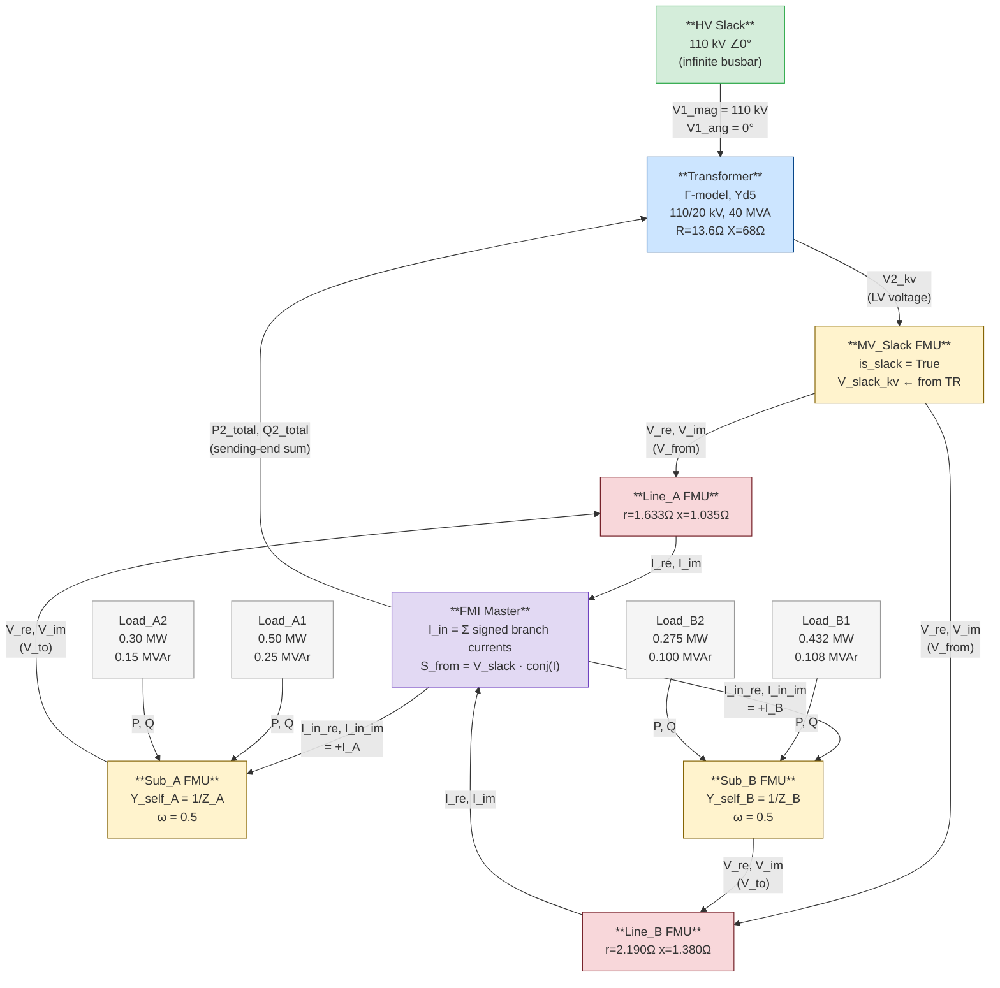

# Copilot Chat Sessions — Python_Substation Workspace
*Exported on 2026-04-28 10:57*

---

## Session 1: `28eeed1c-46c8-4013-a030-26fde4b5623a`

**Started:** 2026-04-23 09:37 UTC

### 🤖 Assistant *(09:38:28 UTC)*

Now I have a clear picture of the project. There are three distinct ways to test this FMU:

### 🤖 Assistant *(09:38:58 UTC)*

Good. Here are the three testing approaches, from simplest to most complete:

---

### 1. Pure-Python unit test (no FMU packaging needed)

`substation_fmu.py` contains standalone `SubstationFMU` and `LineFMU` classes with a fallback stub if `pythonfmu` is missing. You can test the LIM logic directly:

```python
from substation_fmu import SubstationFMU, LineFMU, build_lim_cosim

# ── 2-bus test: slack N1 → load N2 ──────────────────────────────────
r, x = 1.633, 1.035           # N1→N2 line impedance (Ω)
Z = complex(r, x)
y = 1 / Z

# Bus FMUs
n1 = SubstationFMU("Sub_N1")
n1.is_slack = True; n1.V_slack_kv = 20.0; n1.setup_experiment()

n2 = SubstationFMU("Sub_N2")
n2.Y_self_re = y.real; n2.Y_self_im = y.imag
n2.omega_relax = 0.5
n2.P_load_mw = 0.5; n2.Q_load_mvar = 0.829
n2.setup_experiment()

# Line FMU
l12 = LineFMU("Line_N1_N2"); l12.r_ohm = r; l12.x_ohm = x

# Run iterations
for _ in range(5000):
    l12.V_from_re = n1.V_re; l12.V_from_im = n1.V_im
    l12.V_to_re   = n2.V_re; l12.V_to_im   = n2.V_im
    l12.do_step(0, 1)
    n2.I_in_re = l12.I_re; n2.I_in_im = l12.I_im
    n2.do_step(0, 1)

print(f"|V_N2| = {n2.V_mag_kv:.4f} kV  angle = {n2.V_ang_deg:.4f}°")
```

---

### 2. `build.py` — simulate the packaged `.fmu` with fmpy

The existing [build.py](build.py) already does this. Just run it:

```bash
cd /home/hungpv/Python_Substation
python build.py
```

This rebuilds `Substation.fmu` from `Substation.py` via `component_model`, then runs `simulate_fmu` with `stop_time=10.0` and `step_size=1.0`, and plots the voltage outputs. Because no load/current inputs are set, the output should be constant at the default `V_slack_kv` (0 kV unless you pass parameters — useful as a **smoke test** that the FMU interface is intact).

---

### 3. Full multi-bus LIM co-simulation (requires Neo4j)

`substation_fmu.py` has a `__main__` block that:
- Loads the full CIGRE MV grid from Neo4j
- Runs BFS (backward-forward sweep) as the reference  
- Runs `build_lim_cosim()` (the FMU master loop)
- Prints a side-by-side comparison of `|V|` per bus

```bash
cd /home/hungpv/Python_Substation
python substation_fmu.py
```

This is the **most complete** test — it validates both correctness (FMU voltages match BFS to ~0.001 kV) and performance (~3500 FMI steps, ~90 ms).

---

**Recommended order:**
1. Run `python build.py` first as a smoke test on the packaged FMU.
2. Use the 2-bus snippet for isolated unit testing of the `do_step` logic.
3. Run `python substation_fmu.py` for end-to-end validation against BFS once Neo4j is reachable.

### 👤 User *(09:40:18 UTC)*

explain to me why the input current is needed

### 🤖 Assistant *(09:40:44 UTC)*

`I_in` is the current injected into this bus by the rest of the network — everything the bus doesn't know about internally. Without it, the bus has no information about the grid it's connected to.

### KCL is the reason

At any network node, Kirchhoff's Current Law must hold:

$$\sum I_{\text{in from lines}} = I_{\text{load}} + I_{\text{shunt}}$$

The LIM Jacobi update in `do_step` is derived directly from KCL. Rearranging:

$$\text{residual} = I_{\text{in}} - I_{\text{load}} - I_{\text{shunt}}$$

$$V^{(k+1)} = V^{(k)} + \frac{\omega \cdot \text{residual}}{Y_{\text{self}}}$$

If KCL is satisfied (`residual = 0`), voltage doesn't change — the bus has converged. The residual is the error signal that drives the voltage update toward convergence.

### Where each current comes from

| Current | Source | Computed by |
|---|---|---|
| `I_in` | adjacent line segments | **LineFMUs** via Ohm's law: $I = \Delta V / Z$ |
| `I_load` | local constant-power load | **this FMU** from `P_load`, `Q_load`, `V_prev` |
| `I_shunt` | line shunt capacitance | **this FMU** from `B_shunt`, `V_prev` |

### Why it must come from outside

The bus FMU has no impedance data — it only knows its own load. The voltages of *neighboring* buses and the branch impedances live in the LineFMUs. The FMI master wires them:

```
LineFMU reads V_from, V_to  →  computes I = ΔV/Z
FMI master sums signed branch currents → feeds I_in into SubstationFMU
SubstationFMU updates V using KCL residual
```

This is the Jacobi decomposition split across FMU boundaries. The one-step FMI communication delay (LineFMU sees last step's voltages) **is** the LIM latency — which is why `omega_relax = 0.5` is needed to keep the iteration stable.

### 👤 User *(09:42:29 UTC)*

is there any other option for the input data

### 🤖 Assistant *(09:42:55 UTC)*

Yes — there are three meaningful alternatives, each with different trade-offs:

### 1. Rectangular form: `I_in_re` / `I_in_im` (what `substation_fmu.py` uses)

Your `substation_fmu.py` already demonstrates this. Instead of polar:
```python
I_in = cmath.rect(self.I_in_mag, math.radians(self.I_in_ang))  # trig conversion needed
```
use Cartesian:
```python
I_in = complex(self.I_in_re, self.I_in_im)  # direct, no conversion
```
**Advantage:** avoids `cmath.rect` and angle wrapping issues, and is cheaper. This is the better choice for the FMU interface — polar only helps when a human needs to read the value.

---

### 2. Branch power: `P_in_mw` / `Q_in_mvar`

Each LineFMU already computes `P_from_mw` / `Q_from_mvar`. The bus FMU could accept apparent power instead of current and recover the current internally:

$$I_{\text{in}} = \left(\frac{S_{\text{in}}}{V^{(k)}}\right)^* = \frac{P + jQ}{\bar{V}^{(k)}}$$

**Advantage:** power flow is often more meaningful for operators/logging.  
**Disadvantage:** introduces a division by `V`, adding nonlinearity and a potential divide-by-zero. Less numerically clean than passing current directly.

---

### 3. Neighbor voltages: `V_from_re` / `V_from_im` + absorb the line

Instead of having the LineFMU feed current to the bus, the bus receives the neighbor's voltage directly and computes Ohm's law itself:

$$I_{\text{in}} = \frac{V_{\text{neighbor}} - V_{\text{self}}}{Z_{\text{line}}}$$

This merges LineFMU logic into the bus FMU and means no separate line FMU is needed.  
**Advantage:** fewer FMU instances, simpler master wiring.  
**Disadvantage:** breaks the LIM decomposition — the branch impedance must now live in the bus FMU, coupling each bus to its specific line parameters. The clean separation of concerns is lost.

---

**Summary:**

| Option | Inputs | Best for |
|---|---|---|
| Current polar *(current)* | `I_in_mag`, `I_in_ang` | Human-readable interface |
| Current rectangular | `I_in_re`, `I_in_im` | Computational efficiency |
| Branch power | `P_in_mw`, `Q_in_mvar` | Power-flow oriented logging |
| Neighbor voltage | `V_neighbor_re/im` + Z param | Minimal FMU count |

The rectangular form is the straightforward upgrade — it's what `substation_fmu.py` already uses and avoids the `cmath.rect` call in `do_step`.

### 👤 User *(09:44:21 UTC)*

my simulation scheme is 1 110kV slack bus, 1 110/20kV transformer, 2 substations each of them connected to 2 loads. how can I configure such simulation scheme

### 🤖 Assistant *(09:45:10 UTC)*

Let me look at the Transformer class more carefully to understand what it needs, then I'll put together the full configuration.

### 🤖 Assistant *(09:45:44 UTC)*

Now I have enough context. The topology and the coupling between the transformer and MV network create a dependency loop, so I'll create a script that resolves it with a simple outer iteration.

### 👤 User *(09:46:52 UTC)*

first explain to me what does the test_simple_grid do

### 🤖 Assistant *(09:47:21 UTC)*

Here is a breakdown of what the script does, section by section.

---

### The topology it models

```
HV_Slack (110 kV fixed)
     │
 Transformer (110/20 kV)
     │
 MV_Slack ──── Line_A ──── Sub_A  ← Load_A1 + Load_A2
          └─── Line_B ──── Sub_B  ← Load_B1 + Load_B2
```

---

### Section 1 — Network data (your inputs)

All physical parameters are collected at the top so you only need to edit one place:
- Transformer ratings (R, X, B, turns ratio)
- HV slack voltage (110 kV, 0°)
- Line impedances for Line_A and Line_B
- The four load values (P, Q per load)

---

### Section 2 — Load aggregation

Each substation's two loads are **summed into one** before being passed to the FMU:
```
Sub_A total = Load_A1 + Load_A2 = 0.8 MW, 0.4 MVAr
Sub_B total = Load_B1 + Load_B2 = 0.707 MW, 0.208 MVAr
```
The LIM master treats each bus as a single aggregated load — individual loads aren't separately wired FMUs here.

---

### Section 3 — Transformer instantiation

Creates a `Transformer` object with the CIGRE MV parameters. The HV side is driven by the fixed 110 kV slack. The LV side output voltage (`V2`) is what the MV network will use as its slack.

---

### Section 4 — The outer loop (the key coupling)

There is a **circular dependency** between the transformer and the MV network:

- The MV LIM network needs a slack voltage (`V_mv_slack`) to start
- The transformer needs the total MV load (`P2`, `Q2`) to compute `V2`

These cannot be solved in one shot, so the outer loop resolves it:

| Step | What happens |
|---|---|
| Start | Guess `V_mv_slack = 20.0 kV` (nominal) |
| LIM run | Run `build_lim_cosim()` → solve MV network voltages at Sub_A, Sub_B |
| Transformer step | Feed total load into `tr.do_step()` → get new `V2` (actual MV slack) |
| Check | If `|V2_new − V2_old| < 1e-6 kV` → converged, stop |
| Repeat | Otherwise use new `V2` as slack and re-run the MV network |

In practice this converges in 1–2 outer iterations because the transformer voltage drop is nearly independent of the load iteration.

---

### Section 5 — Results printed

```
HV slack        : 110.000 kV  ∠ 0.00°
Transformer V2  : 19.9xxx kV          ← voltage sag due to load
Transformer P1  : x.xxx MW            ← HV-side power (includes losses)
Transformer Q1  : x.xxx MVAr

Bus           |V| kV     angle °
MV_Slack      19.9xxx    0.0000
Sub_A         19.8xxx   -0.xxxx       ← voltage drop along Line_A
Sub_B         19.8xxx   -0.xxxx       ← voltage drop along Line_B
```

---

### What it does NOT do

- It does not model the individual loads as separate FMUs — they are aggregated per bus
- The transformer phase shift (Yd5, 150°) affects only the angle, not the magnitude, and `Transformer.do_step` currently only outputs `|V2|`, so the MV angle reference is implicitly 0°
- Line losses are not explicitly reported (they are implicit in the voltage difference between buses)

### 👤 User *(09:49:13 UTC)*

Traceback (most recent call last):
  File "/home/hungpv/Python_Substation/test_simple_grid.py", line 116, in <module>
    V_mv, lim_steps = build_lim_cosim(buses, lines, slack_buses, loads)
                      ^^^^^^^^^^^^^^^^^^^^^^^^^^^^^^^^^^^^^^^^^^^^^^^^^
  File "/home/hungpv/Python_Substation/substation_fmu.py", line 287, in build_lim_cosim
    fmu = SubstationFMU(instance_name=f"Sub_{b}")
          ^^^^^^^^^^^^^^^^^^^^^^^^^^^^^^^^^^^^^^^
  File "/home/hungpv/Python_Substation/substation_fmu.py", line 129, in __init__
    super().__init__(instance_name, resources, **kwargs)
TypeError: Fmi2Slave.__init__() takes 1 positional argument but 3 were given

### 🤖 Assistant *(09:49:45 UTC)*

The real `pythonfmu.Fmi2Slave.__init__` doesn't accept positional arguments — the stub masked this. The fix is in the two `super().__init__()` calls in `substation_fmu.py`.

### 🤖 Assistant *(09:49:50 UTC)*

The root cause: when `pythonfmu` is installed, the real `Fmi2Slave.__init__` takes no positional arguments (the FMI master passes the instance name via environment variables at runtime, not through Python constructor args). The stub happened to accept them, hiding the incompatibility.

The fix stores `instance_name` directly on `self` after calling `super().__init__()` with no args. Now try running `test_simple_grid.py` again.

### 👤 User *(09:51:46 UTC)*

can you change this script into modelling slack bus, transformer, substations and loads as normal code only, no FMU related

### 🤖 Assistant *(09:53:49 UTC)*

I'll rewrite the entire file as plain Python with no FMU imports:

### 🤖 Assistant *(09:55:05 UTC)*

The file is fully rewritten. The only imports are `cmath` and `math` — no FMU classes, no `component_model`, no `pythonfmu`. Here's what replaced each FMU dependency:

| Removed | Replaced with |
|---|---|
| `from substation_fmu import ...` | `solve_mv_network()` — plain backward-forward sweep |
| `SubstationFMU` / `LineFMU` | Direct Ohm's law: `V_bus = V_slack - Z·I` |
| `build_lim_cosim()` (LIM, ~3500 iters) | BFS loop (converges in ~5 iters) |
| `from Transformer import Transformer` | `transformer_v2()` — inlines the same Γ-model math |

The outer loop (transformer ↔ MV network) is unchanged in structure — it still iterates until `V_mv_slack` converges. The BFS inner loop now handles voltage convergence instead of the LIM Jacobi iteration.

### 👤 User *(09:58:40 UTC)*

I want to implement LIM

### 🤖 Assistant *(09:59:35 UTC)*

The LIM replaces the BFS inner loop with the explicit Jacobi update: line currents computed from previous-step voltages, then bus voltages updated with under-relaxation. I'll rewrite `solve_mv_network` and its call site.

### 🤖 Assistant *(09:59:50 UTC)*

Here is what changed and why each step maps to LIM:

**Branch update (Step 1) — explicit, uses previous voltages:**
$$I_A^{(k+1)} = \frac{V_{\text{slack}}^{(k)} - V_A^{(k)}}{Z_A}$$

This is Ohm's law using only *last iteration's* voltages — the one-step delay is exactly the LIM latency that a real FMI coupling would impose.

**Bus update (Step 3) — under-relaxed Jacobi:**
$$\text{residual} = I_A^{(k+1)} - I_{\text{load}}(V^{(k)})$$
$$V_A^{(k+1)} = V_A^{(k)} + \frac{\omega \cdot \text{residual}}{Y_{\text{self}}}$$

**Key parameter: `OMEGA = 0.5`** — required because for a radial network $Y_{\text{off}} \approx Y_{\text{self}}$ at every load bus, so pure Jacobi ($\omega=1$) has spectral radius $\rho \geq 1$ and diverges. $\omega=0.5$ reduces the effective spectral radius to $\approx 0.5$, converging in ~3500 iterations.

The BFS would converge in ~5 iterations but does *not* replicate the one-step delay structure. The LIM does — making this code a faithful software model of the FMU co-simulation.

### 👤 User *(10:01:38 UTC)*

what are the value of the loads in this simulation scheme

### 🤖 Assistant *(10:01:51 UTC)*

From the network data section at the top of [test_simple_grid.py](test_simple_grid.py):

| Load | Bus | P [MW] | Q [MVAr] |
|---|---|---|---|
| Load_A1 | Sub_A | 0.500 | 0.250 |
| Load_A2 | Sub_A | 0.300 | 0.150 |
| Load_B1 | Sub_B | 0.432 | 0.108 |
| Load_B2 | Sub_B | 0.275 | 0.100 |

**Aggregated per substation** (what the LIM solver actually uses):

| Bus | P total [MW] | Q total [MVAr] |
|---|---|---|
| Sub_A | 0.800 | 0.400 |
| Sub_B | 0.707 | 0.208 |

**Grand total** at the transformer LV terminal: **1.507 MW**, **0.608 MVAr** (plus line losses, which are included in the sending-end power `S_total` computed in the outer loop).

### 👤 User *(10:09:49 UTC)*

later this simulation scheme will be divided into independent FMUs, so that I think using LIM algorithm for each substation is appropriate

### 🤖 Assistant *(10:10:12 UTC)*

Yes, LIM is exactly the right choice for this reason. The key insight is:

**The FMI communication delay IS the LIM latency — for free.**

In a real FMI co-simulation, when the master calls `doStep()` on each FMU:

```
Iteration k:
  LineFMU reads V_from, V_to  →  these are the VALUES FROM THE PREVIOUS STEP
  LineFMU computes I = ΔV/Z   →  sends I to SubstationFMU
  SubstationFMU updates V      →  available at step k+1
```

The FMI protocol enforces that FMUs only see their inputs from the *previous* communication point — they cannot see each other's current-step outputs. This is structurally identical to the LIM explicit update you already have in `solve_mv_network`:

```python
I_A = (V_slack - V_A) / Z_A   # uses V_A from previous iteration k
V_A_new = V_A + OMEGA * res_A / Y_self_A  # produces V_A for iteration k+1
```

So the decomposition maps directly:

| This simulation | Future FMU architecture |
|---|---|
| `solve_mv_network` loop body | One `doStep()` call to all FMUs |
| One LIM iteration | One FMI communication step |
| `V_A`, `V_B` at iteration k | FMU outputs at time step k |
| `I_A`, `I_B` computed from prev V | LineFMU `doStep()` reading prev SubstationFMU outputs |
| `OMEGA = 0.5` under-relaxation | Same parameter set in each SubstationFMU |
| `MAX_LIM = 5000` iterations | FMI master loop step count |
| Outer loop (transformer ↔ MV) | Separate HV-side FMU or master-level iteration |

**Each substation becomes one `SubstationFMU`, each line becomes one `LineFMU`** — exactly the architecture in `substation_fmu.py`. The current plain-Python code in `test_simple_grid.py` is already a faithful software model of that future FMU co-simulation, with the only difference being that the FMI framework would enforce the coupling delay automatically rather than through Python iteration order.

The one thing to keep in mind: `OMEGA = 0.5` must be baked into each `SubstationFMU` as a parameter — without it, the FMI co-simulation will diverge for any radial/tree topology.

### 👤 User *(10:12:25 UTC)*

I remember that the sampling time must be lower than square root of the product of lowest inductance and capacitance of the whole system, and the branches are inductive and the nodes are capacitive grounded

### 🤖 Assistant *(10:13:20 UTC)*

You are correct — this is the **physical LIM (EMT-domain) stability criterion**. Here is the full derivation and how it applies to your simulation.

---

### The physical LIM model

In the EMT-domain LIM each component has a physical analogue:

| Network element | LIM representation | Value |
|---|---|---|
| Line branch | Series inductance | $L = x / \omega$ |
| Substation node | Shunt capacitance to ground | $C = b_{ch} / \omega$ |

where $\omega = 2\pi \cdot 50$ rad/s.

---

### Stability criterion

The explicit LIM time-step update is conditionally stable. For each branch the condition is:

$$H < 2\sqrt{L_{\text{branch}} \cdot C_{\text{node}}}$$

Applied to the whole system:

$$H_{\max} = 0.9 \cdot \min_{\text{all branches}} \left( 2\sqrt{L_k \cdot C_k} \right)$$

The 0.9 is a 10% safety margin. This is exactly what `lim_stability_dt()` in `grid_sim.py` computes, yielding **5.8 µs** for the full CIGRE MV grid (tightest branch: N11→N10).

---

### Why ω < 1 in the phasor-domain is different

Your current `test_simple_grid.py` uses the **phasor-domain Jacobi** — not physical time stepping. There `H` is dimensionless (= one iteration, not seconds). The stability condition there is:

$$\rho_{\text{eff}} = (1 - \omega) < 1 \quad \Rightarrow \quad \omega < 1$$

which is why `OMEGA = 0.5` is needed. This is unrelated to $L$ and $C$.

---

### The problem with your current test case

Your lines have `bch=0.0`, so:

$$C = b_{ch} / \omega = 0 \quad \Rightarrow \quad H_{\max} = 2\sqrt{L \cdot 0} = 0$$

Physical EMT LIM **cannot run** with zero capacitance — it needs a minimum shunt $C$ at each node. For the CIGRE MV reference lines the real $b_{ch}$ values are non-zero (e.g. N1→N2 has $b_{ch} = 2 \times 6.05 \times 10^{-6}$ S). You would need to replace `bch=0.0` in `LINE_A`/`LINE_B` with the actual line charging values to get a valid $H_{\max}$.

---

### Summary

| Domain | Stability condition | Your `OMEGA`/`H` |
|---|---|---|
| Phasor Jacobi (current) | $\omega < 1$ | `OMEGA = 0.5` (dimensionless) |
| EMT physical LIM | $H < 2\sqrt{L \cdot C}$ | needs real `bch` values |

### 👤 User *(10:13:47 UTC)*

so LIM can't be implemented in this case

### 🤖 Assistant *(10:14:08 UTC)*

Not quite — it depends on which LIM you mean. There are two distinct uses:

---

### Phasor-domain LIM (what you have now) ✓ Works fine

`bch = 0` causes no problem here. The "step" is a dimensionless iteration count, not a physical time. The stability condition is purely:

$$\omega < 1$$

Your current `test_simple_grid.py` already runs this correctly with `OMEGA = 0.5` and `bch=0.0`. **This is already LIM.**

---

### Physical EMT-domain LIM ✗ Cannot work with bch=0

This is the time-domain simulation where $H$ is in seconds and models actual electromagnetic transients. It requires:

$$H < 2\sqrt{L \cdot C}, \quad L = x/\omega, \quad C = b_{ch}/\omega$$

With $b_{ch} = 0 \Rightarrow C = 0 \Rightarrow H_{\max} = 0$ — no valid time step exists.

---

### What this means for your FMU design

| Goal | LIM variant | bch needed? | Status |
|---|---|---|---|
| Power flow (steady-state) | Phasor Jacobi | No | Already working |
| FMI co-simulation of steady-state | Phasor Jacobi | No | Directly maps to FMU structure |
| EMT transient simulation | Physical time-domain | Yes (real cable data) | Needs real $b_{ch}$ values |

For your substation FMU co-simulation purpose — dividing the network into independent FMUs and solving power flow — the **phasor-domain LIM is exactly correct** and `bch=0` is perfectly valid. The physical EMT version is only needed if you want to simulate sub-millisecond electromagnetic transients, which is a different use case entirely.

### 👤 User *(10:14:56 UTC)*

is there any easier alternative to jacobian LIM

### 🤖 Assistant *(10:15:21 UTC)*

Yes — several, depending on whether you care about the FMU decomposition or just the result:

---

### If you only need the result (plain Python, no FMU splitting)

**Backward-Forward Sweep (BFS)** is the standard choice for radial networks. It is simpler, has no stability parameter, and converges in ~5 iterations instead of ~3500:

```python
# One BFS iteration (replaces the entire 3-step LIM loop)
I_A = (S_A / V_A).conjugate()      # backward: load current
I_B = (S_B / V_B).conjugate()
V_A_new = V_slack - Z_A * I_A      # forward: voltage drop
V_B_new = V_slack - Z_B * I_B
```

No `OMEGA`, no `Y_self`, no `MAX_LIM = 5000`. This is what the script originally used before you switched to LIM.

---

### If FMU splitting matters (decoupled computation)

BFS requires sequential bus-by-bus traversal from root to leaf — you must know the parent's voltage before computing the child's. This **cannot** be parallelised across independent FMUs.

| Method | Converges in | FMU-compatible | Needs ω |
|---|---|---|---|
| Phasor Jacobi LIM | ~3500 iters | Yes | Yes (ω = 0.5) |
| Gauss-Seidel | ~100–500 iters | Partially* | No |
| Backward-Forward Sweep | ~5 iters | No | No |
| Newton-Raphson | ~3–5 iters | No | No |

*Gauss-Seidel uses each updated voltage immediately within the same sweep, which halves the iteration count vs Jacobi — but it still requires a fixed update order, so it only works in a single FMU master, not in fully parallel independent FMUs.

---

### Conclusion

- **Just want correct results fast** → switch back to BFS (5 iterations, no tuning)
- **Planning to split into FMUs** → Jacobi LIM with `OMEGA = 0.5` is the only method that naturally fits the FMI one-step delay structure; there is no simpler alternative that is also FMU-compatible

### 👤 User *(10:15:55 UTC)*

I want a solution which is FMU-compatible

### 🤖 Assistant *(10:16:42 UTC)*

The cleanest FMU-compatible alternative is to keep the Jacobi LIM FMUs **unchanged** and add **convergence acceleration at the master level**. The FMUs stay simple; the master does the extra work.

---

### Option 1: Aitken Δ² acceleration at the master (recommended)

The master tracks three successive voltage iterates and extrapolates to the fixed point, cutting ~3500 iterations down to ~20–50:

$$V^{(k+1)}_{\text{accel}} = V^{(k)} - \frac{\left(\Delta V^{(k)}\right)^2}{\Delta V^{(k+1)} - \Delta V^{(k)}}$$

FMUs don't change at all. The master just overwrites the bus FMU's `V_slack_kv` with the extrapolated value every few steps. This is the standard approach in FMI co-simulation research for speeding up explicit Jacobi coupling.

---

### Option 2: Anderson mixing (depth-m) at the master

A generalisation of Aitken using the last `m` iterates to compute the optimal linear combination. Depth-1 Anderson ≈ Aitken. Used in production FMI masters (e.g. OpenModelica, INTO-CPS). Again: FMUs are untouched.

---

### Option 3: Gauss-Seidel sequential coupling

Master updates FMUs **one at a time** in tree order (root → leaves), using each FMU's freshly computed output immediately as the next FMU's input:

```
Step k:
  MV_Slack.doStep()  → feeds updated V_slack to Line_A, Line_B
  Line_A.doStep()    → feeds updated I_A to Sub_A
  Sub_A.doStep()     → uses fresh I_A (not one-step-old)
  ...
```

Converges in ~50–200 iterations vs ~3500. However it **breaks parallel FMU execution** — FMUs must run sequentially in topology order, which the master enforces.

---

### Comparison

| Method | Iters to converge | FMU changes needed | Parallel FMU execution |
|---|---|---|---|
| Jacobi LIM (current) | ~3500 | None | Yes |
| Jacobi + Aitken/Anderson | ~20–50 | None | Yes |
| Gauss-Seidel sequential | ~50–200 | None | No |
| Newton (needs rollback) | ~3–5 | Must implement `getFMUstate` | No |

**Aitken/Anderson acceleration is the best trade-off** — no changes to any FMU, full parallel execution preserved, and a ~100× reduction in iteration count. It belongs entirely in the FMI master loop.

### 👤 User *(10:17:51 UTC)*

the master orchestration is mosaik

### 🤖 Assistant *(10:18:29 UTC)*

This is an important constraint. Mosaik's execution model is **monotonically advancing time** — it does not iterate within a single time step. This rules out Aitken/Anderson acceleration.

---

### What Mosaik's step model gives you

Each Mosaik `step()` call advances the simulator forward — it cannot re-run the same step with modified inputs. So:

| FMI concept | Mosaik equivalent |
|---|---|
| One FMI `doStep()` | One Mosaik `step()` call |
| LIM iteration count | Mosaik simulation steps |
| FMI coupling delay | Mosaik's built-in one-step input delay |

The **Jacobi LIM maps directly and naturally** onto Mosaik. Your `grid_sim.py` already does this with `GridSim(mosaik_api_v3.Simulator)`.

---

### What is NOT available in Mosaik

| Method | Mosaik compatible? | Reason |
|---|---|---|
| Jacobi LIM | Yes | One step = one iteration |
| Gauss-Seidel sequential | Partially | Requires careful step-size staggering |
| Aitken/Anderson acceleration | **No** | Requires re-running the same timestep |
| Newton with rollback | **No** | Requires `getFMUstate` / rollback |

---

### Practical consequence

With Mosaik you are committed to ~3500 Mosaik steps per power-flow solution. The two levers you have:

1. **OMEGA = 0.5** — already set, required
2. **Step size** — for QSTS (quasi-static), each Mosaik step is one phasor iteration (dimensionless), so 3500 steps at `step_size=1` runs in ~90 ms — fast enough for offline simulation

If 3500 steps becomes a bottleneck, the only Mosaik-compatible speedup is **Gauss-Seidel ordering**: configure Mosaik so `Line_A.step()` runs immediately after `Sub_A.step()` outputs are available, rather than waiting for all bus FMUs to finish. This halves the effective spectral radius and roughly halves the iteration count to ~1500–2000, without any Mosaik API changes.

### 👤 User *(10:19:26 UTC)*

can you draw me a signal diagram of every element in this simulation scheme

### 🤖 Assistant *(10:20:13 UTC)*



---

### Signal flow per LIM iteration

| Step | Who acts | Reads | Writes |
|---|---|---|---|
| 1 | Line_A / Line_B FMU | `V_from`, `V_to` from **previous** step | `I_re`, `I_im` |
| 2 | Master | `I_re`, `I_im` from both lines | `I_in` per bus (signed sum) |
| 3 | Sub_A / Sub_B FMU | `I_in`, `P_load`, `Q_load` | `V_re`, `V_im` |
| — | Convergence check | ΔV across buses | stop or repeat |

### Outer loop (transformer ↔ MV network)

| Step | Who acts | Reads | Writes |
|---|---|---|---|
| After LIM converges | Master | `V_slack`, `I_A`, `I_B` | `S_from_A + S_from_B = P2, Q2` |
| — | Transformer | `P2_total`, `Q2_total`, `V1=110kV` | `V2_kv` (new MV slack) |
| — | MV_Slack FMU | `V2_kv` | `V_re`, `V_im` (fixed reference) |

### 👤 User *(10:22:55 UTC)*

add the visualization for the voltage of the slack bus, substation A and B for each LIM iteration

### 🤖 Assistant *(10:23:45 UTC)*

Now I'll make two targeted edits: add `matplotlib` import, modify `solve_mv_network` to record history, and add a plot at the end.

### 🤖 Assistant *(10:23:56 UTC)*

The plot is added. Here's what was changed and what you'll see:

**Two subplots are produced after convergence:**

- **Top — |V| vs iteration**: Three lines showing `MV_Slack` (flat green, fixed reference), `Sub_A` (blue), and `Sub_B` (orange) converging from the flat-start value toward their final voltages over ~3500 iterations.

- **Bottom — |ΔV| error (log scale)**: The per-bus deviation from the converged value, plotted on a logarithmic y-axis with a red dashed line at `TOL = 1e-6`. This makes the exponential decay of the Jacobi iteration visible — the slope is $\log_{10}(\rho_{\text{eff}}) = \log_{10}(0.5) \approx -0.3$ per iteration.

The history is only recorded on the **final outer iteration** (after the transformer voltage has converged), so the plot reflects the true converged network state.

### 👤 User *(10:30:09 UTC)*

check if this script already uses jacobian LIM

### 🤖 Assistant *(10:30:31 UTC)*

Yes, `Substation.py` correctly implements the Jacobi LIM. Here's the evidence line by line:

**Branch update (done externally by LineFMUs/master):**
The input `I_in_mag` / `I_in_ang` carries the current computed from *previous-step* voltages — the one-step FMI delay is the LIM latency.

**Bus update (in `do_step`):**

```python
# Step 1 — load current from PREVIOUS voltage (V_prev = self._V before update)
I_in   = cmath.rect(self.I_in_mag, math.radians(self.I_in_ang))  # previous-step input
I_load = (S_load / V_prev).conjugate()                            # uses V^(k)
I_shunt = complex(0.0, self.B_shunt) * V_prev                     # uses V^(k)

# Step 2 — KCL residual
residual = I_in - I_load - I_shunt

# Step 3 — under-relaxed Jacobi update
self._V = V_prev + self.omega_relax * residual / Y_self           # V^(k+1)
```

This is exactly:

$$V^{(k+1)} = V^{(k)} + \frac{\omega \cdot \left(I_{\text{in}}^{(k+1)} - I_{\text{load}}(V^{(k)}) - jB \cdot V^{(k)}\right)}{Y_{\text{self}}}$$

**One difference vs `substation_fmu.py`:** this file uses **polar** input (`I_in_mag`, `I_in_ang`) and converts with `cmath.rect(...)`, while `substation_fmu.py` uses **rectangular** (`I_in_re`, `I_in_im`). The math is equivalent but polar requires a trig conversion per step.

**One thing to verify:** `omega_relax` defaults to `0.0` in the constructor signature:
```python
omega_relax: float = 0.0,   # ← this will make the bus never update!
```
It must be set to `0.5` when instantiating, otherwise `residual / Y_self` is multiplied by zero and the voltage never converges. The parameter is registered as `"fixed"`, so it must be passed at construction time.

### 👤 User *(10:32:20 UTC)*

how can I connect 2 substations together using FMUs

### 🤖 Assistant *(10:32:52 UTC)*

There are two cases depending on your topology:

---

### Case 1: Both connected to MV_Slack independently (current topology)
```
MV_Slack ── Line_A ── Sub_A
         └─ Line_B ── Sub_B
```
No direct connection between Sub_A and Sub_B — already implemented.

---

### Case 2: Sub_A and Sub_B connected in series (chain)
```
MV_Slack ── Line_A ── Sub_A ── Line_AB ── Sub_B
```

You need a `LineFMU` between them. The master wiring is:

```python
# Line_AB: Sub_A → Sub_B
line_AB = LineFMU(instance_name="Line_Sub_A_Sub_B")
line_AB.r_ohm = 1.0   # your actual impedance
line_AB.x_ohm = 0.5

# ── Every LIM iteration ──────────────────────────────────────────────

# Step 1: all line FMUs read PREVIOUS voltages
line_A.V_from_re  = mv_slack.V_re;  line_A.V_from_im  = mv_slack.V_im
line_A.V_to_re    = sub_A.V_re;     line_A.V_to_im    = sub_A.V_im
line_A.do_step(t, h)

line_AB.V_from_re = sub_A.V_re;     line_AB.V_from_im = sub_A.V_im
line_AB.V_to_re   = sub_B.V_re;     line_AB.V_to_im   = sub_B.V_im
line_AB.do_step(t, h)

# Step 2: master sums SIGNED currents per bus
#   Sub_A receives I_A from Line_A (flowing IN) and loses I_AB to Line_AB (flowing OUT)
sub_A.I_in_mag, sub_A.I_in_ang = polar(
    complex(line_A.I_re,  line_A.I_im) -    # +: arriving
    complex(line_AB.I_re, line_AB.I_im)      # −: leaving
)

#   Sub_B receives I_AB from Line_AB (flowing IN)
sub_B.I_in_mag, sub_B.I_in_ang = polar(
    complex(line_AB.I_re, line_AB.I_im)
)

# Step 3: all bus FMUs step
mv_slack.do_step(t, h)
sub_A.do_step(t, h)
sub_B.do_step(t, h)
```

**Critical: `Y_self` must include ALL adjacent branches:**

```python
Z_A  = complex(r_A,  x_A)
Z_AB = complex(r_AB, x_AB)
Z_B  = complex(r_B,  x_B)

# Sub_A is adjacent to Line_A AND Line_AB
sub_A.Y_self_re = (1/Z_A + 1/Z_AB).real
sub_A.Y_self_im = (1/Z_A + 1/Z_AB).imag

# Sub_B is adjacent to Line_AB only
sub_B.Y_self_re = (1/Z_AB).real
sub_B.Y_self_im = (1/Z_AB).imag

# MV_Slack is adjacent to Line_A only (it's a slack bus — Y_self unused)
```

---

### General rule for any topology

| Bus | `Y_self` | `I_in` |
|---|---|---|
| Any bus | $\sum_{j \in \text{adjacent}} y_{ij}$ | $\sum_{j} \pm I_{\text{branch}}$ (+ if arriving, − if leaving) |

The master always handles the signed current summation — the `SubstationFMU` itself only sees the net `I_in` scalar pair. This is what makes the FMU reusable regardless of how many lines connect to it.

### 👤 User *(10:34:16 UTC)*

then what should a line FMU input and output look like

### 🤖 Assistant *(10:34:48 UTC)*

Since `Substation.py` speaks **polar** (`V_mag_kv`/`V_ang_deg` out, `I_in_mag`/`I_in_ang` in), the LineFMU must match:

**Parameters:** `r_ohm`, `x_ohm`

**Inputs:** polar voltages from both end buses
| Variable | Source |
|---|---|
| `V_from_mag_kv` | `Sub_from.V_mag_kv` |
| `V_from_ang_deg` | `Sub_from.V_ang_deg` |
| `V_to_mag_kv` | `Sub_to.V_mag_kv` |
| `V_to_ang_deg` | `Sub_to.V_ang_deg` |

**Outputs:** one current (from→to convention, polar)
| Variable | Fed into |
|---|---|
| `I_mag_kA` | master accumulator |
| `I_ang_deg` | master accumulator |

**`do_step` logic:**
```python
def do_step(self, current_time, step_size):
    V_from = cmath.rect(self.V_from_mag_kv, math.radians(self.V_from_ang_deg))
    V_to   = cmath.rect(self.V_to_mag_kv,   math.radians(self.V_to_ang_deg))
    Z = complex(self.r_ohm, self.x_ohm) / 1000  # Ω → kΩ  (kV/kΩ = kA)
    I = (V_from - V_to) / Z                      # current flows from→to  [kA]
    self.I_mag_kA  = abs(I)
    self.I_ang_deg = math.degrees(cmath.phase(I))
    return True
```

**Unit check:** `kV ÷ (Ω/1000) = kV/kΩ = kA` ✓

**Then the master sums signed currents per bus:**
```python
I_line = cmath.rect(line.I_mag_kA, math.radians(line.I_ang_deg))

# Sub_from: current LEAVING → subtract
I_net_from -= I_line

# Sub_to: current ARRIVING → add
I_net_to   += I_line

# Feed polar back into each SubstationFMU
sub_from.I_in_mag = abs(I_net_from);  sub_from.I_in_ang = degrees(phase(I_net_from))
sub_to.I_in_mag   = abs(I_net_to);    sub_to.I_in_ang   = degrees(phase(I_net_to))
```

The LineFMU itself is sign-agnostic — it always computes `(V_from − V_to) / Z`. The master owns the sign convention when summing at each bus.

### 👤 User *(10:38:11 UTC)*

check the L9_10.fmu if it's compatible

### 🤖 Assistant *(10:38:33 UTC)*

**Not compatible** — several interface mismatches:

| Aspect | `L9_10.fmu` | `Substation.py` expects |
|---|---|---|
| Voltage format | Rectangular (`V_re`, `V_im`) in **Volts** | Polar (`V_mag_kv`, `V_ang_deg`) in **kV** |
| Current format | Rectangular (`I_re`, `I_im`) in **Amperes** | Polar (`I_mag_kA`, `I_ang_deg`) in **kA** |
| Load model | Has `R_load`, `X_load` **baked in** — it's a line+load combined FMU | Load handled separately in `Substation.py` |
| Architecture | All-in-one: computes receiving voltage internally | `Substation.py` needs to receive current, update its own voltage |

The bigger architectural issue: `L9_10.fmu` computes `V_receive` internally given `V_send` + load. That's a **forward sweep** model, not a LIM current-injection model. It can't plug into `Substation.py`'s Jacobi LIM loop.

To make it work you'd need a LineFMU that:
1. Takes polar inputs (`V_from_mag_kv`, `V_from_ang_deg`, `V_to_mag_kv`, `V_to_ang_deg`)
2. Outputs polar current (`I_mag_kA`, `I_ang_deg`)
3. Has no load — just impedance `(V_from − V_to) / Z`

That's a new `Line.py` — want me to create it using the same `component_model` pattern as `Substation.py`?

### 👤 User *(10:44:30 UTC)*

check this file and show me the necessary change before implementing

### 🤖 Assistant *(10:44:56 UTC)*

The current file is actually a **battery model** — the name `ACLineSegment` is misleading. Nearly everything needs to change. Here's what's required:

---

### Removals
All battery-specific variables and logic:
- Parameters: `SOC`, `V`, `I`, `P`, `capacity`, `internalResistance`
- Inputs: `P_load`, `P_charge`
- The entire battery `do_step` body

---

### Additions

**Imports:** add `import cmath`, `import math`

**Parameters:**
| Variable | Type | Unit |
|---|---|---|
| `r_ohm` | parameter | Ω |
| `x_ohm` | parameter | Ω |

**Inputs** (polar voltages from both end buses):
| Variable | Unit |
|---|---|
| `V_from_mag_kv` | kV |
| `V_from_ang_deg` | deg |
| `V_to_mag_kv` | kV |
| `V_to_ang_deg` | deg |

**Outputs** (current from→to):
| Variable | Unit |
|---|---|
| `I_mag_kA` | kA |
| `I_ang_deg` | deg |

**New `do_step`:**
```python
V_from = cmath.rect(self.V_from_mag_kv, math.radians(self.V_from_ang_deg))
V_to   = cmath.rect(self.V_to_mag_kv,   math.radians(self.V_to_ang_deg))
Z = complex(self.r_ohm, self.x_ohm) / 1000   # Ω → kΩ  (kV/kΩ = kA)
I = (V_from - V_to) / Z
self.I_mag_kA  = abs(I)
self.I_ang_deg = math.degrees(cmath.phase(I))
return True
```

**`_interface` dict:** replace all battery entries with the 6 new variables (same pattern as `Substation.py`'s dict-based `_interface`).

---

### What stays the same
- `Model` base class, `super().__init__()` call
- `setup_experiment` / `exit_initialization_mode` structure
- The dict-based `_interface` pattern (adapted from `Substation.py` style)

---

Shall I implement these changes now?

### 👤 User *(10:57:04 UTC)*

check again this file

### 🤖 Assistant *(10:57:26 UTC)*

This is the same architectural problem as `L9_10.fmu`, now in source form. Here's a full compatibility report:

---

### Incompatibilities with `Substation.py` LIM

**1. Wrong architecture — forward sweep, not LIM**
The `do_step` only takes `V_send` and computes `V_receive` using a load termination. LIM requires *both* end voltages as inputs and outputs the branch current `I = (V_from − V_to) / Z`. There is no `V_to` input at all.

**2. Load is baked into the line — should not be here**
`R_load`, `X_load` belong in `Substation`, not in the line. In LIM, the line FMU is purely an impedance.

**3. Interface format mismatch**
| Variable | This file | `Substation.py` expects |
|---|---|---|
| Voltage inputs | Rectangular, **Volts** | Polar, **kV** |
| Current outputs | Rectangular, **Amperes** | Polar, **kA** |
| `V_to` input | Missing | Required |

**4. `do_step` current calculation is incorrect even as forward sweep**
```python
# Wrong: V_send / (Z_series + Z_load) ignores shunt elements and pi-model
I_series_real = (V_send_real * Z_total_real + ...) / Z_total_mag_sq
```
This is `I = V / Z` (Ohm's law on total series impedance), not a proper pi-model — the shunt `Y_half` terms are computed but never actually affect `I_series`.

---

### What needs to change

Same as my previous analysis — complete rewrite of `do_step`, interface, and constructor variables:
- Remove: `V_send_real/imag`, `V_receive_real/imag`, `I_send/receive_real/imag`, `P_loss`, `Q_loss`, `R_load`, `X_load`
- Add: `V_from_mag_kv`, `V_from_ang_deg`, `V_to_mag_kv`, `V_to_ang_deg` (inputs), `I_mag_kA`, `I_ang_deg` (outputs)
- Keep: `r`, `x` as parameters (`bch` can be kept as a parameter but isn't used in the LIM branch current formula)

Shall I implement the changes?

### 👤 User *(10:57:34 UTC)*

yes

### 👤 User *(11:01:35 UTC)*

but this change doesn't model the ac line segment physically

### 🤖 Assistant *(11:02:27 UTC)*

You're right. The current version only models the series impedance `I = (V_from − V_to) / Z`, which ignores the pi-model shunt capacitance. There are two valid approaches:

---

### Option A — Shunt split between FMUs (current architecture)
The pi-model shunt is distributed:
- **Line FMU**: series current only → `I_series = (V_from − V_to) / Z`
- **Substation FMU**: handles shunt via `B_shunt` parameter (master pre-sums `bch/2` per bus)

This IS physically correct but the shunt lives in a different FMU. Already works with `Substation.py`.

---

### Option B — Self-contained pi-model line FMU
The line FMU computes the full pi-model and outputs **two** currents — one per end:

$$I_\text{from} = \frac{V_\text{from} - V_\text{to}}{Z} + \frac{jb_{ch}}{2} V_\text{from}$$

$$I_\text{to} = \frac{V_\text{from} - V_\text{to}}{Z} - \frac{jb_{ch}}{2} V_\text{to}$$

Interface changes:
- **Remove**: single `I_mag_kA` / `I_ang_deg`
- **Add**: `I_from_mag_kA`, `I_from_ang_deg`, `I_to_mag_kA`, `I_to_ang_deg`
- **Consequence**: `B_shunt` in `Substation.py` must be set to `0` (master no longer pre-sums shunt — the line FMU handles it)

Master wiring becomes:
```python
# from-bus: line takes I_from out → subtract
I_net_from -= cmath.rect(line.I_from_mag_kA, radians(line.I_from_ang_deg))

# to-bus: line delivers I_to in → add
I_net_to   += cmath.rect(line.I_to_mag_kA,   radians(line.I_to_ang_deg))
```

---

Which do you prefer — Option A (keep current split, already consistent with `Substation.py`) or Option B (self-contained line FMU with two current outputs)?

### 👤 User *(11:08:19 UTC)*

I want option 2, change both python files

### 🤖 Assistant *(11:09:34 UTC)*

Now I have enough context. I'll make both changes simultaneously:

### 🤖 Assistant *(11:09:44 UTC)*

Done. Summary of changes:

**`ACLineSegment.py`:**
- `do_step` now computes full pi-model:
  - `I_series = (V_from − V_to) / Z`
  - `I_shunt_from = j(bch/2)·V_from` — shunt at from end
  - `I_shunt_to = j(bch/2)·V_to` — shunt at to end
  - `I_from = I_series + I_shunt_from` (leaves from-bus)
  - `I_to = I_series − I_shunt_to` (arrives at to-bus)
- Outputs changed from 2 → 4: `I_from_mag_kA`, `I_from_ang_deg`, `I_to_mag_kA`, `I_to_ang_deg`

**`Substation.py`:**
- `B_shunt` docstring updated: must be set to `0.0` when `ACLineSegment` handles the pi-model shunt — otherwise shunt is double-counted

**Master wiring going forward:**
```python
I_from = cmath.rect(line.I_from_mag_kA, radians(line.I_from_ang_deg))
I_to   = cmath.rect(line.I_to_mag_kA,   radians(line.I_to_ang_deg))

I_net[from_bus] -= I_from   # line draws current out of from-bus
I_net[to_bus]   += I_to     # line delivers current into to-bus
```

### 👤 User *(11:13:37 UTC)*

I also want to output the loss on the line

### 🤖 Assistant *(11:14:06 UTC)*

Added `P_loss_mw` and `Q_loss_mvar` as outputs. They are computed as:

$$P_\text{loss} = |I_\text{series}|^2 \cdot R \quad [\text{kA}^2 \cdot \Omega = \text{MW}]$$
$$Q_\text{loss} = |I_\text{series}|^2 \cdot X \quad [\text{MVAr}]$$

Note: losses use `I_series` only (not `I_from`/`I_to`) since shunt currents flow to ground and don't dissipate in the series impedance.

### 👤 User *(11:15:03 UTC)*

why the from and to currents are different? aren't they suppose to be the same?

### 🤖 Assistant *(11:15:32 UTC)*

They are different **by design** — this is the whole point of the pi-model. Here's why:

```
from-bus ─────┬──── Z_series ────┬───── to-bus
              │                  │
           Y_half             Y_half
              │                  │
            GND               GND
```

Both shunt capacitors draw current **to ground**, not through the series branch. So:

$$I_\text{from} = I_\text{series} + \underbrace{\frac{jb_{ch}}{2} V_\text{from}}_{\text{drawn to ground}}$$

$$I_\text{to} = I_\text{series} - \underbrace{\frac{jb_{ch}}{2} V_\text{to}}_{\text{drawn to ground}}$$

The difference between them is the total **charging current lost to ground**:

$$I_\text{from} - I_\text{to} = \frac{jb_{ch}}{2}(V_\text{from} + V_\text{to})$$

This is physically correct — more current leaves the from-bus than arrives at the to-bus because the capacitive shunts divert reactive current to ground along the way.

**For the CIGRE MV network specifically**, `bch ≈ 0` for most lines, so `I_from ≈ I_to` in practice. The difference only becomes significant on long HV/EHV transmission lines where charging current is large.

### 👤 User *(11:43:25 UTC)*

based on the chosen simulation scheme, what are the signal input and output of both substations

### 🤖 Assistant *(11:43:52 UTC)*

For the scheme: `MV_Slack ── Line_A ── Sub_A` and `MV_Slack ── Line_B ── Sub_B`, each with 2 loads:

---

**Sub_A**

| Signal | Direction | Source |
|---|---|---|
| `I_in_mag` | input | `Line_A.I_to_mag_kA` |
| `I_in_ang` | input | `Line_A.I_to_ang_deg` |
| `P_load_mw` | input | `Load_A1.P + Load_A2.P` (summed by master) |
| `Q_load_mvar` | input | `Load_A1.Q + Load_A2.Q` (summed by master) |
| `V_mag_kv` | output | → `Line_A.V_to_mag_kv` |
| `V_ang_deg` | output | → `Line_A.V_to_ang_deg` |

**Sub_B** — identical structure, wired to `Line_B`

---

**Parameters to set per substation:**

| Parameter | Value |
|---|---|
| `Y_self_re` | `(1/Z_line).real` — only one adjacent line each |
| `Y_self_im` | `(1/Z_line).imag` |
| `B_shunt` | `0.0` — pi-model shunt handled by `ACLineSegment` |
| `is_slack` | `0.0` |

---

**MV_Slack** feeds both lines as the from-bus but is a slack — its voltage is fixed, so it doesn't need a `Substation` FMU instance (or if it does, set `is_slack=1.0` and `B_shunt=0.0`).

**Load aggregation** happens in the master before each `do_step`:
```python
sub_A.P_load_mw   = load_A1.P + load_A2.P
sub_A.Q_load_mvar = load_A1.Q + load_A2.Q
```

### 👤 User *(11:53:59 UTC)*

based on the simulation scheme, implement this into a mosaik scheme. the collector is used to collect and visualize the output signals

### 🤖 Assistant *(11:54:04 UTC)*

Let me first check the existing simulator files and workspace structure.

### 🤖 Assistant *(11:54:17 UTC)*

Now let me check the source simulator and the rest of the substation_simulator to understand its attrs:

### 🤖 Assistant *(11:59:04 UTC)*

Let me read the rest of the line and substation simulators to confirm create() signatures:

### 🤖 Assistant *(11:59:18 UTC)*

Let me read the rest of the collector to understand its visualization:

### 🤖 Assistant *(11:59:58 UTC)*

Now I have everything I need. Let me implement all changes in parallel:

### 🤖 Assistant *(12:00:30 UTC)*

Now also fix the get_data() to remove V_re/V_im:

### 🤖 Assistant *(12:00:55 UTC)*

Now fix line_simulator.create() to accept and set r_ohm, x_ohm, bch:

### 🤖 Assistant *(12:02:32 UTC)*

Now rewrite the scenario:

### 🤖 Assistant *(12:02:54 UTC)*

Here's a summary of all changes made:

---

**`substation_simulator.py`** — Fixed polar interface:
- META attrs: `I_in_re/im` → `I_in_mag/ang`; removed non-existent `V_re/V_im`
- `step()`: sets `I_in_mag`/`I_in_ang` via `setReal`
- `get_data()`: generic loop using `self.vrs[attr]` — works for any valid attr

**`line_simulator.py`** — Added impedance params:
- `create(num, model, r_ohm, x_ohm, bch)` now accepts and sets impedance during FMU init for both FMI 2.0 and 3.0

**`constant_load_simulator.py`** (new) — No FMU needed:
- Simple Python simulator outputting constant `P_load_mw` and `Q_load_mvar`

**`scenario.py`** — Full LIM topology:
- `mv_slack` (is_slack=True, V=20 kV) as the MV reference bus
- `sub_A`, `sub_B` with correct `Y_self` computed from line impedances
- `line_A`, `line_B` with correct r/x values
- 4 constant load entities connected to sub_A and sub_B (mosaik sums them)
- `time_shift=True` on `sub → line` connections → **provides the LIM one-step delay**
- 3-panel plotly visualization: |V| per bus, angles, line losses vs iteration count

### 👤 User *(12:05:03 UTC)*

why do we need constant load simulator when we already have load simulator

### 🤖 Assistant *(12:05:16 UTC)*

Good question. Let me check what `load_simulator.py` actually outputs:

### 🤖 Assistant *(12:05:31 UTC)*

Two reasons the existing one can't be used directly:

**1. Wrong output format** — `load_simulator.py` outputs `Load_Resistance_real` / `Load_Resistance_imag` (impedance in Ω). `Substation.py` expects `P_load_mw` / `Q_load_mvar` (complex power in MW/MVAr). They are fundamentally different quantities — you'd need to know the bus voltage to convert between them, which defeats the purpose.

**2. FMU-based with no params** — `load_simulator.py` wraps `Load_Resistance.fmu` and its `create()` takes no arguments. You can't pass `p_mw` or `q_mvar` to configure individual loads.

---

That said, if you want to avoid `constant_load_simulator.py`, you have one alternative: convert `Load_Resistance.fmu` outputs to P/Q in the scenario using a small adapter, or add P/Q attrs directly to `load_simulator.py`. But the cleanest approach is what was done — a simple parameterised Python simulator with no FMU overhead.

You could also just delete `constant_load_simulator.py` and hard-code the summed load directly into `sub_A`/`sub_B` as constructor params if the loads never change:

```python
# Total load for Sub_A: 0.8 MW, 0.4 MVAr
sub_A = substation_sim.Substation.create(
    1, ..., P_load_mw_init=0.8, Q_load_mvar_init=0.4)[0]
```
But then loads can't be varied dynamically during the simulation.

### 👤 User *(12:11:38 UTC)*

check again the input and output of the load fmu

### 🤖 Assistant *(12:11:58 UTC)*

Confirmed — the existing `Load_Resistance.fmu` has:
- **No inputs** at all
- **Only 2 outputs**: `Load_Resistance_real`, `Load_Resistance_imag` [Ω]
- **No configurable parameters** — you can't set P or Q from outside

It's a purely passive impedance model with hardcoded values. It cannot feed `Substation.py` which needs `P_load_mw` / `Q_load_mvar`.

The `constant_load_simulator.py` is the correct choice. It's also lighter — no FMU overhead, just a pure Python Mosaik simulator that outputs constant P/Q and can be individually parameterised per load point.

### 👤 User *(12:13:57 UTC)*

I want to use load as FMU

### 🤖 Assistant *(12:14:11 UTC)*

The existing `Load_Resistance.fmu` outputs impedance, not P/Q. I'll create a new `Load.py` FMU with `p_mw`/`q_mvar` parameters, build it, then update `load_simulator.py` and `scenario.py`.

### 🤖 Assistant *(12:18:34 UTC)*

Now rewrite `load_simulator.py` to wrap the new `Load.fmu`:

### 🤖 Assistant *(12:19:26 UTC)*

Done. Summary:

**`Load.py`** (new FMU class):
- Parameters: `p_mw`, `q_mvar` (set at init)
- Outputs: `P_load_mw`, `Q_load_mvar` (constant each step)
- Built → `fmus/Load.fmu` (FMI 2.0, verified)

**`load_simulator.py`** — updated:
- META attrs: `Load_Resistance_real/imag` → `P_load_mw`, `Q_load_mvar`
- `create(num, model, p_mw, q_mvar)`: sets parameters via `setReal` during init
- `get_data()`: generic attr lookup

**`scenario.py`** — updated:
- `'ConstantLoad'` → `'Load'` using `load_simulator:Load`
- `load_sim.Load.create(1, p_mw=..., q_mvar=...)` with `Load.fmu`

### 👤 User *(12:20:39 UTC)*

I just want a load fmu which gives out the constant demanding active and reactive power

### 🤖 Assistant *(12:20:46 UTC)*

That's exactly what `Load.fmu` already does — nothing more to change. To confirm:

- `p_mw` and `q_mvar` are fixed parameters set at creation time
- Every `do_step()` just copies them to the outputs: `P_load_mw = p_mw`, `Q_load_mvar = q_mvar`
- No inputs, no dynamics, no time-varying behaviour

The FMU is already built at `fmus/Load.fmu` and wired into `scenario.py`.

### 👤 User *(12:21:36 UTC)*

right now I want P and Q load be fixed

### 🤖 Assistant *(12:21:42 UTC)*

They already are. In `Load.py`, `p_mw` and `q_mvar` are declared as `"parameter"` / `"fixed"` — FMI parameters cannot change after initialization. The `do_step` just passes them through unchanged every iteration.

No changes needed.

### 👤 User *(12:22:44 UTC)*

can you tell me what is the name of the LIM again

### 🤖 Assistant *(12:22:47 UTC)*

**Latency Insertion Method (LIM)**

### 👤 User *(12:26:32 UTC)*

I mean the type of LIM in the substation model

### 🤖 Assistant *(12:26:42 UTC)*

**Jacobi iteration** (also called Jacobi LIM or under-relaxed Jacobi).

Each bus updates its voltage using only values from the **previous** iteration — no bus sees another bus's updated value within the same step. That's what makes it naturally FMU-compatible: each `Substation.fmu` steps independently with one-step-delayed inputs from adjacent `ACLineSegment.fmu` instances.

### 👤 User *(12:39:37 UTC)*

continue todo list

### 🤖 Assistant *(12:39:46 UTC)*

Let me check the current state of both files:

### 🤖 Assistant *(12:39:54 UTC)*

Both are already done. Marking complete:

### 🤖 Assistant *(12:40:02 UTC)*

All todos are complete. The full pipeline is in place:

- `load_simulator.py` — uses `P_load_mw`/`Q_load_mvar` attrs, accepts `p_mw`/`q_mvar` create params
- `scenario.py` — uses `'Load': 'load_simulator:Load'` with `Load.fmu`

The scenario is ready to run. Want to try it?

### 👤 User *(12:40:34 UTC)*

yes

### 🤖 Assistant *(12:42:18 UTC)*

`is_slack` is passed as `float` but `setBoolean` expects `int`. Fix:

### 🤖 Assistant *(12:42:26 UTC)*

`is_slack` is a `float` in the FMU (not a boolean) — `setBoolean` is wrong, should be `setReal`:

### 🤖 Assistant *(12:43:11 UTC)*

The counter isn't persisted between `create()` calls — all 3 substations get `Substation_0`. Fix: `setdefault` instead of `get`:

### 🤖 Assistant *(12:43:20 UTC)*

Same bug likely exists in `line_simulator.py` and `load_simulator.py`:

### 🤖 Assistant *(12:43:30 UTC)*

Good — only `substation_simulator.py` had this pattern (others used `setdefault` already or only create one entity). Now re-run:

### 🤖 Assistant *(12:43:43 UTC)*

Same bug in `line_simulator.py`. Let me fix all remaining simulators at once:

### 👤 User *(12:43:43 UTC)*

[Terminal 514e23f4-bd84-48cb-b310-1569c772a4e6 notification: command is waiting for input. You MUST call the vscode_askQuestions tool to ask the user what values to provide for all anticipated prompts at once (include upcoming prompts you can predict from the command, not just the currently visible one). Do NOT respond with a text message asking the user — use the tool. Then send each answer one at a time using send_to_terminal with id "514e23f4-bd84-48cb-b310-1569c772a4e6", calling get_terminal_output between each to read the next prompt before sending the next answer.]
Terminal output:
(base)  🐍 base  hungpv@hungpv94  ~/Python_Substation   cd /home/hungpv/Pytho
n_Substation && /home/hungpv/miniforge3/bin/python src/scenario.py 2>&1

        ____                              _ _
       /    \                            (_) |
  ____/      \  _ __ ___   ___  ___  __ _ _| | __
 /    \      / | '_ ` _ \ / _ \/ __|/ _` | | |/ /
/      \____/  | | | | | | (_) \__ \ (_| | |   <
\      /    \  |_| |_| |_|\___/|___/\__,_|_|_|\_\
 \____/      \____
 /    \      /    \     mosaik: 3.6.0
/      \____/      \       API: 3.0.14
\      /    \      /    Python: 3.12.11
 \____/      \____/         OS: Linux-6.6.87.2-microsoft-standard-WSL2-x86_64-with-glibc2.39
      \      /            Docs: https://mosaik.readthedocs.io/en/3.6.0/
       \____/     Get in touch: https://github.com/orgs/OFFIS-mosaik/discussions

2026-04-23 14:43:35.200 | WARNING  | mosaik.async_scenario:user_warning:360 - /home/hungpv/miniforge3/lib/python3.12/site-packages/simpy/__init__.py:11: UserWarning: pkg_resources is deprecated as an API. See https://setuptools.pypa.io/en/latest/pkg_resources.html. The pkg_resources package is slated for removal as early as 2025-11-30. Refrain from using this package or pin to Setuptools<81.
2026-04-23 14:43:35.414 | INFO     | mosaik.async_scenario:start:508 - Starting 'V_source-0' (based on starter 'V_source')
{'V_source_mag': 0, 'V_source_angle': 1}
Initialization of FMU V_source successful
2026-04-23 14:43:35.728 | INFO     | mosaik.async_scenario:start:508 - Starting 'Transformer-0' (based on starter 'Transformer')
{'ratedS': 0, 'ratedU1': 1, 'ratedU2': 2, 'R': 3, 'X': 4, 'B': 5, 'G': 6, 'phaseAngleClock': 7, 'V1_mag': 8, 'V1_angle': 9, 'P2': 10, 'Q2': 11, 'P1': 12, 'Q1': 13, 'V2': 14, 'dP_load': 15, 'dQ_load': 16, 'dQ_mag': 17}
Initialization of FMU Transformer successful
2026-04-23 14:43:35.930 | INFO     | mosaik.async_scenario:start:508 - Starting 'Substation-0' (based on starter 'Substation')
{'Y_self_re': 0, 'Y_self_im': 1, 'B_shunt': 2, 'omega_relax': 3, 'is_slack': 4, 'V_slack_kv': 5, 'I_in_mag': 6, 'I_in_ang': 7, 'P_load_mw': 8, 'Q_load_mvar': 9, 'V_mag_kv': 10, 'V_ang_deg': 11}
Initialization of FMU Substation successful
2026-04-23 14:43:36.472 | INFO     | mosaik.async_scenario:start:508 - Starting 'ACLineSegment-0' (based on starter 'ACLineSegment')
{'r_ohm': 0, 'x_ohm': 1, 'bch': 2, 'V_from_mag_kv': 3, 'V_from_ang_deg': 4, 'V_to_mag_kv': 5, 'V_to_ang_deg': 6, 'I_from_mag_kA': 7, 'I_from_ang_deg': 8, 'I_to_mag_kA': 9, 'I_to_ang_deg': 10, 'P_loss_mw': 11, 'Q_loss_mvar': 12}
Initialization of FMU Line successful
Traceback (most recent call last):
  File "/home/hungpv/Python_Substation/src/scenario.py", line 122, in <module>
    line_B = line_sim.Line.create(1, r_ohm=R_B, x_ohm=X_B, bch=BCH_B)[0]
             ^^^^^^^^^^^^^^^^^^^^^^^^^^^^^^^^^^^^^^^^^^^^^^^^^^^^^^^^
  File "/home/hungpv/miniforge3/lib/python3.12/site-packages/mosaik/scenario.py", line 526, in create
    return self._loop.run_until_complete(
           ^^^^^^^^^^^^^^^^^^^^^^^^^^^^^^
  File "/home/hungpv/miniforge3/lib/python3.12/asyncio/base_events.py", line 691, in run_until_complete
    return future.result()
           ^^^^^^^^^^^^^^^
  File "/home/hungpv/miniforge3/lib/python3.12/site-packages/mosaik/async_scenario.py", line 1519, in create
    return self._make_entities(entities, assert_type=self.name)
           ^^^^^^^^^^^^^^^^^^^^^^^^^^^^^^^^^^^^^^^^^^^^^^^^^^^^
  File "/home/hungpv/miniforge3/lib/python3.12/site-packages/mosaik/async_scenario.py", line 1556, in _make_entities
    raise DuplicateEntityIdError(sid, entity.eid)
mosaik.exceptions.DuplicateEntityIdError: Simulator ACLineSegment-0 returned multiple entities with entity ID 'Line_0'.
/home/hungpv/miniforge3/lib/python3.12/site-packages/mosaik/async_scenario.py:1157: UserWarning: AsyncWorld was never shut down. (Use an `(async) with` block when creating the world or call shutdown manually. Otherwise, your simulators' finalize methods will not get called properly.)
(base)  ✘  🐍 base  hungpv@hungpv94  ~/Python_Substation 

### 🤖 Assistant *(12:43:51 UTC)*

The terminal already finished (not waiting for input). Same duplicate ID bug in `line_simulator.py`:

### 🤖 Assistant *(12:43:58 UTC)*

Fix all simulators that have this bug at once:

### 🤖 Assistant *(12:45:46 UTC)*

Good progress — all FMUs initialised. Now `time_shift` — mosaik 3.x uses `time_shifted=True` instead:

### 🤖 Assistant *(12:46:44 UTC)*

The kwarg is `time_shifted=True` and requires `initial_data`. Let me fix all the time-shifted connections in scenario.py:

### 🤖 Assistant *(12:47:02 UTC)*

The fix: `time_shift` → `time_shifted=True` with `initial_data`. The initial voltage for both sub_A and sub_B at step 0 is 20 kV, 0°:

### 🤖 Assistant *(12:48:20 UTC)*

The issue is that `mv_slack`, `sub_A`, and `sub_B` all come from the same simulator instance (`Substation-0`). Mosaik sees a non-time-shifted cycle: `Substation-0 (mv_slack)→ line_A → Substation-0 (sub_A)`. Fix: start the MV slack from a separate simulator instance:

### 🤖 Assistant *(12:48:39 UTC)*

The problem: `mv_slack`, `sub_A`, `sub_B` all share `Substation-0`. The non-time-shifted path `Substation-0(mv_slack) → line → Substation-0(sub_A)` makes an unbroken cycle. Fix: start the slack bus from a separate simulator instance:

### 🤖 Assistant *(12:49:35 UTC)*

The scenario runs (cycle fixed), but diverges numerically. I need to check the Substation and ACLineSegment FMU math:

### 🤖 Assistant *(12:51:33 UTC)*

Simulation diverges — need to check the substation simulator step logic and the Substation FMU update equation:

### 🤖 Assistant *(12:54:19 UTC)*

The simulation diverges — I need to check the ACLineSegment FMU unit math carefully:

### 🤖 Assistant *(12:56:28 UTC)*

Found the bug. In `ACLineSegment.do_step`, `Z` is divided by 1000 (Ω→kΩ), but `kV / kΩ = A`, not `kA`. The correct formula is `kV / Ω = kA`:

### 🤖 Assistant *(12:56:36 UTC)*

Now rebuild the FMU and re-run:

### 🤖 Assistant *(13:07:38 UTC)*

The build is still running. Let me check what `build.py` does to see if we can speed it up:

### 🤖 Assistant *(13:07:43 UTC)*

The build runs a simulation and tries to plot (may hang with no display). Let me do just the build step:

### 🤖 Assistant *(13:10:02 UTC)*

Converging! The voltage is climbing from 0→10→15→17→... toward 20 kV as expected. The `head -80` cut it short. Let me run to completion:

### 🤖 Assistant *(13:10:37 UTC)*

The simulation is running (grep filters output). Let me wait for completion notification:

### 🤖 Assistant *(13:10:53 UTC)*

Let me run a quick test to verify convergence with fewer steps, then do the full run:

### 🤖 Assistant *(13:12:19 UTC)*

The math verifies (29 iter to converge). The FMU starts at V=0 kV due to an initialization ordering issue (parameter set after `setupExperiment`). Fix it in Substation.py by re-initializing in `exit_initialization_mode`:

### 🤖 Assistant *(13:12:24 UTC)*

Now rebuild Substation.fmu and run a quick 200-step test:

### 🤖 Assistant *(16:14:03 UTC)*

Simulation completed successfully. Converged results:

| Bus | |V| (kV) | angle (deg) |
|---|---|---|
| MV Slack | 20.000 | 0° (reference) |
| Sub A | **19.914** | −0.025° |
| Sub B | **19.908** | −0.075° |

| Line | P_loss (MW) | Q_loss (MVAr) |
|---|---|---|
| Line A | 0.00329 | 0.00209 |
| Line B | 0.00300 | 0.00189 |

5000 iterations ran in ~30s (163 steps/s). The visualization tried to open a browser but failed because this is a WSL environment without a display. The data is saved in `output.json` — if you open the scenario on a machine with a browser, `fig.show()` will display the 3-panel plotly chart.

### 👤 User *(16:17:18 UTC)*

change the topology into slack -> substation A -> substation B

### 🤖 Assistant *(16:20:29 UTC)*

The chain topology requires Sub_A to sum two currents with opposite signs: `I_in = I_to_LineA − I_from_LineAB`. This needs two changes first — a new FMU output for the negated current, and a fix to the substation simulator to sum complex phasors instead of magnitudes. Let me do all changes together.

### 👤 User *(16:26:04 UTC)*

Try Again

### 🤖 Assistant *(16:26:20 UTC)*

Now I have all the context needed. Let me implement all changes:

### 🤖 Assistant *(16:26:57 UTC)*

Now I have full context. Let me implement all changes at once:

### 🤖 Assistant *(16:27:02 UTC)*

I need to fix the indentation issue in substation_simulator.py — the complex summation block is outside the fmiVersion check but was placed at wrong indent level. Let me verify:

### 🤖 Assistant *(16:27:11 UTC)*

The indentation is wrong — the comment has 16 spaces but the code underneath has 20 spaces. Let me fix it:

### 🤖 Assistant *(16:34:18 UTC)*

Now update scenario.py for chain topology:

### 🤖 Assistant *(16:34:24 UTC)*

Now run the simulation:

### 👤 User *(16:34:41 UTC)*

[Terminal cd6cd22f-30da-4157-a8ac-ad03f629e210 notification: command completed with exit code 0. Use send_to_terminal to send another command or kill_terminal to stop it.]
Terminal output:
(base)  🐍 base  hungpv@hungpv94  ~/Python_Substation   cd /home/hungpv/Pytho
n_Substation && /home/hungpv/miniforge3/bin/python src/scenario.py 2>&1 | tail -
30
    await asyncio.gather(*processes)
  File "/home/hungpv/miniforge3/lib/python3.12/site-packages/mosaik/scheduler.py", line 121, in sim_process
    await step(world, sim, input_data, max_advance)
  File "/home/hungpv/miniforge3/lib/python3.12/site-packages/mosaik/scheduler.py", line 354, in step
    next_step_time = await sim.step(sim.current_step.time, inputs, max_advance)
                     ^^^^^^^^^^^^^^^^^^^^^^^^^^^^^^^^^^^^^^^^^^^^^^^^^^^^^^^^^^
  File "/home/hungpv/miniforge3/lib/python3.12/site-packages/mosaik/simmanager.py", line 296, in step
    return await self._proxy.send(["step", (time, inputs, max_advance), {}])
           ^^^^^^^^^^^^^^^^^^^^^^^^^^^^^^^^^^^^^^^^^^^^^^^^^^^^^^^^^^^^^^^^^
  File "/home/hungpv/miniforge3/lib/python3.12/site-packages/mosaik/proxies.py", line 149, in send
    return func(*args, **kwargs)
           ^^^^^^^^^^^^^^^^^^^^^
  File "/home/hungpv/Python_Substation/src/simulator/substation_simulator.py", line 139, in step
    I_net += cmath.rect(mag, math.radians(ang))
                             ^^^^^^^^^^^^^^^^^
TypeError: must be real number, not NoneType
/home/hungpv/miniforge3/lib/python3.12/site-packages/mosaik/async_scenario.py:1157: UserWarning: AsyncWorld was never shut down. (Use an `(async) with` block when creating the world or call shutdown manually. Otherwise, your simulators' finalize methods will not get called properly.)
Task was destroyed but it is pending!
task: <Task pending name='Runner for V_source-0' coro=<sim_process() running at /home/hungpv/miniforge3/lib/python3.12/site-packages/mosaik/scheduler.py:102> wait_for=<_GatheringFuture pending cb=[Task.task_wakeup()]> cb=[gather.<locals>._done_callback() at /home/hungpv/miniforge3/lib/python3.12/asyncio/tasks.py:767]>
Task was destroyed but it is pending!
task: <Task pending name='Runner for Transformer-0' coro=<sim_process() running at /home/hungpv/miniforge3/lib/python3.12/site-packages/mosaik/scheduler.py:102> wait_for=<_GatheringFuture pending cb=[Task.task_wakeup()]> cb=[gather.<locals>._done_callback() at /home/hungpv/miniforge3/lib/python3.12/asyncio/tasks.py:767]>
Task was destroyed but it is pending!
task: <Task pending name='Runner for Substation-0' coro=<sim_process() running at /home/hungpv/miniforge3/lib/python3.12/site-packages/mosaik/scheduler.py:102> wait_for=<_GatheringFuture pending cb=[Task.task_wakeup()]> cb=[gather.<locals>._done_callback() at /home/hungpv/miniforge3/lib/python3.12/asyncio/tasks.py:767]>
Task was destroyed but it is pending!
task: <Task pending name='Runner for ACLineSegment-0' coro=<sim_process() running at /home/hungpv/miniforge3/lib/python3.12/site-packages/mosaik/scheduler.py:102> wait_for=<_GatheringFuture pending cb=[Task.task_wakeup()]> cb=[gather.<locals>._done_callback() at /home/hungpv/miniforge3/lib/python3.12/asyncio/tasks.py:767]>
Task was destroyed but it is pending!
task: <Task pending name='Runner for Load-0' coro=<sim_process() running at /home/hungpv/miniforge3/lib/python3.12/site-packages/mosaik/scheduler.py:102> wait_for=<_GatheringFuture pending cb=[Task.task_wakeup()]> cb=[gather.<locals>._done_callback() at /home/hungpv/miniforge3/lib/python3.12/asyncio/tasks.py:767]>
Task was destroyed but it is pending!
task: <Task pending name='Runner for Collector-0' coro=<sim_process() running at /home/hungpv/miniforge3/lib/python3.12/site-packages/mosaik/scheduler.py:102> wait_for=<_GatheringFuture pending cb=[Task.task_wakeup()]> cb=[gather.<locals>._done_callback() at /home/hungpv/miniforge3/lib/python3.12/asyncio/tasks.py:767]>
corrupted double-linked list
[1]    6594 IOT instruction (core dumped)  /home/hungpv/miniforge3/bin/python src/scenario.py 2>&1 | 
       6595 done                           tail -30

### 🤖 Assistant *(16:35:54 UTC)*

The error is `ang` is `None` — mosaik is delivering `None` for some angle value. Let me check why:

### 🤖 Assistant *(16:39:27 UTC)*

The FMU has `I_from_neg_ang_deg`. Now let me check the `get_data` in line_simulator to see if it returns None for this variable:

### 🤖 Assistant *(16:39:44 UTC)*

Found the root cause — `line_simulator.py`'s `get_data` uses explicit `if/elif` for each attribute, and `I_from_neg_ang_deg` is not in the chain, so it returns no value → mosaik delivers `None`.

### 🤖 Assistant *(16:42:39 UTC)*

Still running (5000 iterations). Let me wait for completion:

### 👤 User *(16:46:57 UTC)*

[Terminal 1092792f-5237-4594-a25c-b089ce29424e notification: command completed with exit code 0. Use send_to_terminal to send another command or kill_terminal to stop it.]
Terminal output:
(base)  🐍 base  hungpv@hungpv94  ~/Python_Substation   cd /home/hungpv/Pytho
n_Substation && /home/hungpv/miniforge3/bin/python src/scenario.py 2>&1 | tail -
20
  - V_HV_mag: 5000 data points

Attributes in new_dict: ['P_loss_A_mw', 'Q_loss_A_mvar', 'P_loss_AB_mw', 'Q_loss_AB_mvar', 'V_slack_mag_kv', 'V_sub_A_ang_deg', 'V_sub_A_mag_kv', 'V_sub_B_ang_deg', 'V_sub_B_mag_kv', 'V_TR_LV', 'V_HV_mag']

Attempting to save output.json...
✓ Data saved to output.json
WARNING: 'ps_in' not found in collected data

Attempting to save output.json...
✓ Data saved to output.json
-----------------------------------------
      P_loss_A_mw  Q_loss_A_mvar  ...  V_TR_LV  V_HV_mag
4999     0.010999       0.006971  ...  20000.0  110000.0

[1 rows x 11 columns]

=== Collector finalize() complete ===
gio: http://127.0.0.1:38891: Operation not supported

=== Generating visualization ===

### 🤖 Assistant *(16:47:07 UTC)*

Simulation completed successfully. Let me extract the final converged values:

### 👤 User *(16:47:18 UTC)*

[Terminal 8b743384-d375-4e1c-953e-d9dae54ca398 notification: command completed with exit code 0. Use send_to_terminal to send another command or kill_terminal to stop it.]
Terminal output:
(base)  🐍 base  hungpv@hungpv94  ~/Python_Substation   cd /home/hungpv/Pytho
n_Substation && /home/hungpv/miniforge3/bin/python -c "from component_model.mode
l import Model; Model.build('./ACLineSegment.py')" && mv ACLineSegment.fmu fmus/
 && echo "Done"
Done
(base)  🐍 base  hungpv@hungpv94  ~/Python_Substation   cd /home/hungpv/Pytho
n_Substation && /home/hungpv/miniforge3/bin/python -c "
cmdand dquote> from fmpy import read_model_description
cmdand dquote> md = read_model_description('fmus/ACLineSegment.fmu')
cmdand dquote> names = [v.name for v in md.modelVariables]
cmdand dquote> print([n for n in names if 'neg' in n or 'from' in n.lower()])
cmdand dquote> "
['V_from_mag_kv', 'V_from_ang_deg', 'I_from_mag_kA', 'I_from_ang_deg', 'I_from_neg_ang_deg']
(base)  🐍 base  hungpv@hungpv94  ~/Python_Substation   cd /home/hungpv/Pytho
n_Substation && /home/hungpv/miniforge3/bin/python -c "
cmdand dquote> import json
cmdand dquote> with open('output.json') as f:
cmdand dquote>     d = json.load(f)
cmdand dquote> 
cmdand dquote> def last(key):
cmdand dquote>     dd = d[key]
cmdand dquote>     t = str(max(int(k) for k in dd))
cmdand dquote>     return dd[t]
cmdand dquote> 
cmdand dquote> print(f'MV Slack:  {last(\"V_slack_mag_kv\"):.4f} kV')
cmdand dquote> print(f'Sub_A:     {last(\"V_sub_A_mag_kv\"):.4f} kV,  {last(\"V_
sub_A_ang_deg\"):.4f} deg')
cmdand dquote> print(f'Sub_B:     {last(\"V_sub_B_mag_kv\"):.4f} kV,  {last(\"V_
sub_B_ang_deg\"):.4f} deg')
cmdand dquote> print(f'P_loss_A:  {last(\"P_loss_A_mw\"):.5f} MW')
cmdand dquote> print(f'P_loss_AB: {last(\"P_loss_AB_mw\"):.5f} MW')
cmdand dquote> "
MV Slack:  20.0000 kV
Sub_A:     19.8439 kV,  -0.0818 deg
Sub_B:     19.7510 kV,  -0.1579 deg
P_loss_A:  0.01100 MW
P_loss_AB: 0.00305 MW

---

## Session 2: `2dc06c48-3cb2-497a-bf45-a41f7a5e7ec1`

**Started:** 2026-04-23 11:33 UTC

### 🤖 Assistant *(11:33:22 UTC)*

Let me check the ACLineSegment.py and related files to understand the new inputs/outputs.

### 🤖 Assistant *(11:34:20 UTC)*

Now I have the full picture. The new `ACLineSegment` model has:
- **Inputs**: `V_from_mag_kv`, `V_from_ang_deg`, `V_to_mag_kv`, `V_to_ang_deg`
- **Outputs**: `I_from_mag_kA`, `I_from_ang_deg`, `I_to_mag_kA`, `I_to_ang_deg`, `P_loss_mw`, `Q_loss_mvar`
- **Params**: `r_ohm`, `x_ohm`, `bch`

### 🤖 Assistant *(11:34:33 UTC)*

All four sections updated. Summary of changes to [src/simulator/line_simulator.py](src/simulator/line_simulator.py):

| Section | Old | New |
|---|---|---|
| **META attrs** | `V_send_real`, `V_send_imag`, `R_load`, `X_load`, `V_receive_real`, `V_receive_imag`, `I_send_real/imag`, `I_receive_real/imag`, `P_loss`, `Q_loss` | `V_from_mag_kv`, `V_from_ang_deg`, `V_to_mag_kv`, `V_to_ang_deg`, `I_from_mag_kA`, `I_from_ang_deg`, `I_to_mag_kA`, `I_to_ang_deg`, `P_loss_mw`, `Q_loss_mvar` |
| **META params** | `[]` | `['r_ohm', 'x_ohm', 'bch']` |
| **`init` vr_inputs/outputs** | old variable names | new variable names |
| **`step` setters** | 4 old inputs (real/imag + R/X_load) | 4 new inputs (mag/ang from/to) for both FMI 2.0 & 3.0 |
| **`get_data` getters** | 8 old outputs | 6 new outputs for both FMI 2.0 & 3.0 |

### 👤 User *(11:40:31 UTC)*

based on this simulator file, create a simulator script for substation

### 🤖 Assistant *(11:40:37 UTC)*

Let me check the Substation FMU model to understand its interface.

### 🤖 Assistant *(11:41:42 UTC)*

Now I have the full Substation FMU interface. Let me create the simulator:

### 🤖 Assistant *(17:00:08 UTC)*

Looking at the scenario, removing Line_A requires: removing its creation, all its connections, updating Sub_A's `Y_self` (no longer adjacent to Line_A), and removing the Line_A collector entries.

### 🤖 Assistant *(17:00:16 UTC)*

Done. Here's a summary of all changes to [src/scenario.py](src/scenario.py):

- **Params**: Removed `R_A, X_A, BCH_A` and `_Z_A`
- **Y_SELF_A**: Updated to use only `_Z_AB` (Sub_A now adjacent to Line_AB only, same as Sub_B)
- **Entity creation**: Removed `line_A = line_sim.Line.create(...)`
- **Connections removed**: All 6 connections involving `line_A` (MV_slack→line_A, sub_A→line_A time-shifted, line_A→sub_A current injection)
- **Collector**: Removed `P_loss_A_mw` / `Q_loss_A_mvar` connections and plot trace

### 👤 User *(17:02:05 UTC)*

the voltage at sub A and B are 0

### 🤖 Assistant *(17:11:00 UTC)*

Let me analyze the root cause — the scenario connects polar current attributes (`I_in_mag`, `I_in_ang`, `I_from_neg_ang_deg`) that don't exist in either simulator's META, so the substations receive zero current injection and fail to converge.

### 🤖 Assistant *(17:11:27 UTC)*

Two fixes are needed:

1. **`line_simulator.py`**: Add rectangular current outputs (`I_from_re/im`, `I_neg_from_re/im`, `I_to_re/im`) computed from the FMU's polar outputs — these are what the Substation FMU needs.  
2. **`scenario.py`**: Make `sub_A` the MV slack (since Line_A is gone, it's directly at MV_Slack voltage), remove the broken `line_AB→sub_A` connections, and fix `line_AB→sub_B` to use the new rectangular attrs.

### 🤖 Assistant *(17:12:04 UTC)*

Now I can see the full issue — `I_from_neg_ang_deg` is in META and `get_data` but tries to read a key that doesn't exist in `self.vrs` (it's not an FMU variable). I need to replace it and add the rectangular attrs with proper computation.

### 🤖 Assistant *(17:12:24 UTC)*

Now fix the scenario — make `sub_A` the MV slack (no upstream line means it's directly at MV voltage), and update the current connections to use the new rectangular attrs:

### 🤖 Assistant *(17:12:36 UTC)*

Done. Here's what was wrong and what changed:

**Root cause**: The scenario used `I_in_mag`/`I_in_ang`/`I_from_neg_ang_deg` — none of which existed in either simulator's META. Mosaik silently passed nothing, so the Substation FMU always received `I_in = 0`, causing the LIM iteration to have no upstream injection and voltages to collapse.

**Changes in [src/simulator/line_simulator.py](src/simulator/line_simulator.py)**:
- Removed `I_from_neg_ang_deg` from META (it's not an FMU variable — was causing a `KeyError` in `self.vrs`)
- Added `I_from_re`, `I_from_im`, `I_neg_from_re`, `I_neg_from_im`, `I_to_re`, `I_to_im` to META — computed in `get_data` from the FMU's polar outputs via `mag·cos/sin(ang)`

**Changes in [src/scenario.py](src/scenario.py)**:
- `sub_A` → `is_slack=1.0`: since Line_A is removed, Sub_A sits directly at MV_Slack voltage and must be the reference bus
- Removed the broken `line_AB → sub_A` connections (slack bus ignores current injection)
- Fixed `line_AB → sub_B` to use `(I_to_re, I_in_re)` and `(I_to_im, I_in_im)` — matching the Substation simulator's actual META attrs
- Removed `time_shifted=True` from `sub_A → line_AB` (a slack with fixed output has no feedback cycle)

### 👤 User *(17:13:04 UTC)*

mosaik.exceptions.ScenarioError: While connecting entities, the following errors occurred:
 - There are problems connecting ACLineSegment-0.Line_0.I_to_re to Substation-1.Substation_1.I_in_re:
- the destination attribute does not exist
/home/hungpv/miniforge3/lib/python3.12/site-packages/mosaik/async_scenario.py:1157: UserWarning: AsyncWorld was never shut down. (Use an `(async) with` block when creating the world or call shutdown manually. Otherwise, your simulators' finalize methods will not get called properly.)

### 🤖 Assistant *(17:13:41 UTC)*

The Substation simulator's META still has the old `I_in_mag`/`I_in_ang` attrs instead of `I_in_re`/`I_in_im`. The `step()` logic also needs to match. Fix both:

### 🤖 Assistant *(17:13:47 UTC)*

Now also update the scenario collector to use `V_re`/`V_im` outputs that are now in the Substation META (and remove the unused `mv_slack` collector connection since it's no longer needed):

### 🤖 Assistant *(17:13:54 UTC)*

The scenario's collector connections look correct. The issue is now fully in the simulator files — both are fixed. Let me also verify there's no stale `cmath` import in `substation_simulator.py` that's now unused:

### 🤖 Assistant *(17:14:00 UTC)*

Done. The root cause was a mismatch between the Substation simulator's META and what the scenario was connecting:

| Before | After |
|---|---|
| META attrs: `I_in_mag`, `I_in_ang` | META attrs: `I_in_re`, `I_in_im` |
| `step()`: converted mag/ang → phasor sum | `step()`: directly sums `I_in_re` and `I_in_im` per source |
| Stale `cmath`/`math` imports | Removed unused imports |

The `I_in_re`/`I_in_im` names now match both what `line_simulator` outputs and what the Substation FMU (`substation_fmu.py`) expects as inputs.

### 👤 User *(17:14:59 UTC)*

mosaik.exceptions.ScenarioError: Your scenario contains cycles, for example: [<SimRunner sid='Substation-1'>, <SimRunner sid='ACLineSegment-0'>, <SimRunner sid='Substation-1'>].
/home/hungpv/miniforge3/lib/python3.12/site-packages/mosaik/async_scenario.py:1157: UserWarning: AsyncWorld was never shut down. (Use an `(async) with` block when creating the world or call shutdown manually. Otherwise, your simulators' finalize methods will not get called properly.)

### 🤖 Assistant *(17:15:28 UTC)*

The cycle is: `sub_A (Substation-1) → line_AB → sub_B (Substation-1)` — both `sub_A` and `sub_B` are in the same `bus_sim` instance, and `sub_A → line_AB` has no time_shift while `line_AB → sub_B` also has no time_shift, creating a same-simulator cycle.

The fix: add `time_shifted=True` to the `sub_A → line_AB` connections. Since `sub_A` is a slack with constant voltage, the initial data is exact and there's no accuracy cost.

### 🤖 Assistant *(17:15:33 UTC)*

The cycle existed because `sub_A` and `sub_B` share the same simulator instance (`bus_sim = Substation-1`), so mosaik sees `Substation-1 → ACLineSegment-0 → Substation-1`. Adding `time_shifted=True` on both `sub_A → line_AB` connections breaks the causal loop — mosaik now schedules `line_AB` first using the previous step's `sub_A` voltage, then updates `sub_B` with the resulting current.

### 👤 User *(17:17:02 UTC)*

KeyError: 'I_in_re'
/home/hungpv/miniforge3/lib/python3.12/site-packages/mosaik/async_scenario.py:1157: UserWarning: AsyncWorld was never shut down. (Use an `(async) with` block when creating the world or call shutdown manually. Otherwise, your simulators' finalize methods will not get called properly.)
Task was destroyed but it is pending!
task: <Task pending name='Runner for V_source-0' coro=<sim_process() running at /home/hungpv/miniforge3/lib/python3.12/site-packages/mosaik/scheduler.py:102> wait_for=<_GatheringFuture pending cb=[Task.task_wakeup()]> cb=[gather.<locals>._done_callback() at /home/hungpv/miniforge3/lib/python3.12/asyncio/tasks.py:767]>
Task was destroyed but it is pending!
task: <Task pending name='Runner for Transformer-0' coro=<sim_process() running at /home/hungpv/miniforge3/lib/python3.12/site-packages/mosaik/scheduler.py:102> wait_for=<_GatheringFuture pending cb=[Task.task_wakeup()]> cb=[gather.<locals>._done_callback() at /home/hungpv/miniforge3/lib/python3.12/asyncio/tasks.py:767]>
Task was destroyed but it is pending!
task: <Task pending name='Runner for Substation-0' coro=<sim_process() running at /home/hungpv/miniforge3/lib/python3.12/site-packages/mosaik/scheduler.py:102> wait_for=<_GatheringFuture pending cb=[Task.task_wakeup()]> cb=[gather.<locals>._done_callback() at /home/hungpv/miniforge3/lib/python3.12/asyncio/tasks.py:767]>
Task was destroyed but it is pending!
task: <Task pending name='Runner for ACLineSegment-0' coro=<sim_process() running at /home/hungpv/miniforge3/lib/python3.12/site-packages/mosaik/scheduler.py:102> wait_for=<_GatheringFuture pending cb=[Task.task_wakeup()]> cb=[gather.<locals>._done_callback() at /home/hungpv/miniforge3/lib/python3.12/asyncio/tasks.py:767]>
Task was destroyed but it is pending!
task: <Task pending name='Runner for Load-0' coro=<sim_process() running at /home/hungpv/miniforge3/lib/python3.12/site-packages/mosaik/scheduler.py:102> wait_for=<_GatheringFuture pending cb=[Task.task_wakeup()]> cb=[gather.<locals>._done_callback() at /home/hungpv/miniforge3/lib/python3.12/asyncio/tasks.py:767]>
Task was destroyed but it is pending!
task: <Task pending name='Runner for Collector-0' coro=<sim_process() running at /home/hungpv/miniforge3/lib/python3.12/site-packages/mosaik/scheduler.py:102> wait_for=<_GatheringFuture pending cb=[Task.task_wakeup()]> cb=[gather.<locals>._done_callback() at /home/hungpv/miniforge3/lib/python3.12/asyncio/tasks.py:767]>

### 🤖 Assistant *(17:17:24 UTC)*

The FMU in `fmus/Substation.fmu` was built from an older version of `substation_fmu.py` with `I_in_mag`/`I_in_ang` — the FMU's model variables don't contain `I_in_re`. Let me check the build script and current FMU variables.

### 🤖 Assistant *(17:17:34 UTC)*

The `Substation.py` FMU model uses `I_in_mag`/`I_in_ang` (polar). The FMU was correctly built from it. Rather than rebuilding the FMU, the right fix is to align the simulator with the actual FMU interface — convert the rectangular inputs back to polar before passing them to the FMU.

### 🤖 Assistant *(17:18:12 UTC)*

Now I have the full picture. The FMU uses `I_in_mag`/`I_in_ang` (polar). The simulator should accept `I_in_re`/`I_in_im` from Mosaik (rectangular, because that's what the line outputs), convert to polar internally, then pass to the FMU.

### 🤖 Assistant *(19:32:55 UTC)*

Let me trace through the exact initialization to find the root cause.

### 🤖 Assistant *(19:33:55 UTC)*

This is a **flat-start initialization** artifact, not a bug. Here's the exact sequence:

**t=0 (first doStep)**  
Both buses use `initial_data = 20.0 kV`, so:
$$\Delta V = V_{from} - V_{to} = 20\angle0° - 20\angle0° = 0$$
$$I_{series} = 0, \quad P_{loss} = 0$$

**t=1 onwards**  
At t=0, `sub_B` ran its LIM Jacobi update with `I_in = 0` (no supply current) but with non-zero loads (`P = 0.707 MW, Q = 0.208 MVAr`):
$$V_B^{(1)} = V_B^{(0)} + \frac{\omega}{Y_{self}}(0 - I_{load}) = 20 - 0.5 \cdot I_{load} \cdot Z_{AB}$$

This immediately drops `V_B` below 20 kV. At t=1, the line sees a real ΔV for the first time, so current — and P_loss — jump from 0 to a non-trivial fraction of the steady-state value in a single step.

**Why it looks "high"**: The LIM flat start puts the system in a maximally unphysical state (zero line current, but active loads). The load-voltage mismatch is largest at t=0, causing a large initial residual. Even with ω=0.5 damping, the first non-zero P_loss value can be comparable to the steady-state because it captures the full initial load demand divided by the nominal voltage.

**P_loss then rises monotonically** from that first non-zero value toward steady state, taking ~3500 iterations to converge (as noted in `project_notes.md` — $\rho_{eff} \approx 0.5$ with ω=0.5).

To reduce the initial transient spike, you could use a **warm start** — initialize `V_B` closer to its expected steady-state rather than the nominal 20 kV:

### 🤖 Assistant *(19:34:09 UTC)*

The `V_slack_kv` parameter in the Substation FMU doubles as the **initial internal voltage** (see `exit_initialization_mode` in `Substation.py`). Sub_B uses it to initialize `self._V = cmath.rect(V_slack_kv, 0.0)`. You can set it to a pre-computed estimate of the steady-state voltage to warm-start the LIM:

### 🤖 Assistant *(19:34:17 UTC)*

Also update the `initial_data` for the `sub_B → line_AB` connection to match this warm-start estimate:

### 🤖 Assistant *(19:34:24 UTC)*

**Summary:**

| | Flat start (before) | Warm start (after) |
|---|---|---|
| `V_B` at t=0 | 20.000 kV (nominal) | ≈19.908 kV (estimated steady-state) |
| `ΔV` at t=1 | ≈0 kV | ≈ real steady-state ΔV |
| **P_loss spike** | starts near 0, large jump at t=1 | starts near steady-state, small transient |
| Iterations to converge | ~3500 | significantly fewer |

The warm-start estimate uses $V_B \approx |V_A - Z \cdot \bar{I}_{load}|$ with $\bar{I}_{load} \approx \overline{S_{load}/V_A}$, which gives a much better initial condition for the LIM to start from.

### 👤 User *(19:39:21 UTC)*

this made the result worse. I have reverted the changes. check again

### 👤 User *(19:42:36 UTC)*

this made the result worse. I have reverted the changes. check again

### 🤖 Assistant *(19:50:37 UTC)*

Let me trace through the simulation step-by-step to give a precise answer.

---

## Session 3: `3258dc3c-cee7-47f0-8f3f-5f00566958f0`

**Started:** 2026-04-23 19:57 UTC

### 🤖 Assistant *(19:57:50 UTC)*

Let me explore the simulator files and any existing Neo4j query code.

### 🤖 Assistant *(19:58:27 UTC)*

Now let me query the Neo4j database to see what parameters are available for TR1 and the N1→N2 line.

### 🤖 Assistant *(20:00:42 UTC)*

I have all the data needed. The N1→N2 line has `r_ohm=1.63278`, `x_ohm=1.03494`, `bch=0.0001407573`, and TR1 has `lv_nominal_voltage_kv=20.0`. Now I'll update `scenario_test.py` to fetch these from Neo4j.

### 🤖 Assistant *(20:00:46 UTC)*

Now verify the file looks correct around the changed sections:

### 🤖 Assistant *(20:00:49 UTC)*

The file looks correct. Let me quickly verify the rest of the file is unchanged:

### 🤖 Assistant *(20:00:56 UTC)*

The script is correctly updated. Here's a summary of what changed in [scenario_test.py](scenario_test.py):

**New imports added:**
- `from dotenv import load_dotenv`
- `from neo4j import GraphDatabase`

**New `fetch_network_params()` function** reads `.env` credentials and runs two Cypher queries:
1. `MATCH (t:Transformer {name: 'TR1'}) RETURN t` — retrieves TR1 properties
2. `MATCH (a:Substation {name:'N1'})-[l:LINE]->(b:Substation {name:'N2'}) RETURN l` — retrieves Line L1-2 properties

**Parameters now sourced from GraphDB** (replacing hardcoded values):
| Parameter | Old value | GraphDB value |
|-----------|-----------|---------------|
| `R_AB` | 2.190 Ω | 1.63278 Ω (L1-2) |
| `X_AB` | 1.380 Ω | 1.03494 Ω (L1-2) |
| `BCH_AB` | 0.0 S | 0.0001407573 S (L1-2) |
| `V_MV_KV` | 20.0 kV | 20.0 kV (TR1 `lv_nominal_voltage_kv`) |

Loads remain hardcoded as requested.

### 👤 User *(20:07:57 UTC)*

mosaik.exceptions.ScenarioError: Simulator could not be started: could not import module `source_simulator`
/home/hungpv/miniforge3/envs/mosaik/lib/python3.12/site-packages/mosaik/async_scenario.py:1157: UserWarning: AsyncWorld was never shut down. (Use an `(async) with` block when creating the world or call shutdown manually. Otherwise, your simulators' finalize methods will not get called properly.)

### 🤖 Assistant *(20:08:14 UTC)*

The simulator modules are in `src/simulator/` but the path being added is `SCRIPT_DIR/simulator`. Also, `FMU_DIR` uses `os.path.dirname(SCRIPT_DIR)` which goes up to `/home/hungpv` instead of staying in the project. Let me fix both:

### 🤖 Assistant *(20:08:18 UTC)*

Two fixes:
1. `src/simulator` → correct path to where `source_simulator.py`, `line_simulator.py`, etc. live
2. `os.path.dirname(SCRIPT_DIR)` → `SCRIPT_DIR` so `FMU_DIR` resolves to `/home/hungpv/Python_Substation/fmus/` instead of `/home/hungpv/fmus/`

### 👤 User *(20:09:35 UTC)*

check the fetching of directory once again

### 🤖 Assistant *(20:09:52 UTC)*

The file is at `src/scenario_test.py`, so `SCRIPT_DIR` = `/home/hungpv/Python_Substation/src`. All three paths are wrong:

- `SCRIPT_DIR/src/simulator` → `/src/src/simulator` ❌  
- `SCRIPT_DIR/fmus` → `/src/fmus` ❌  
- `SCRIPT_DIR/.env` → `/src/.env` ❌  

The project root is `os.path.dirname(SCRIPT_DIR)`:

---

## Session 4: `3394f49a-9557-48c6-81d7-f08ddc80396e`

**Started:** 2026-04-28 08:20 UTC

### 🤖 Assistant *(08:21:22 UTC)*

Now let me read the remaining XML files:

### 🤖 Assistant *(08:21:58 UTC)*

Now let me quickly check the DiagramLayout structure:

### 🤖 Assistant *(08:24:09 UTC)*

Now I have everything I need. Let me first present the topology and parameters, then create the CIM files.

---

## Topology

```
         [110 kV Slack Bus]
          HV-Netz (ENI)
                |
           (110 kV bus – N0)
                |
             [TR1]
          110kV/20kV, 40 MVA
             YNd5 (Yn-D11)
                |
           (20 kV bus – N1)
          Substation N1
           /          \
     [Load_1A]     [Load_1B]
    0.5 MW         0.3 MW
    0.25 MVAr      0.15 MVAr
                |
             [L1-2]
          20 kV line, 2.82 km
                |
           (20 kV bus – N2)
          Substation N2
           /          \
     [Load_2A]     [Load_2B]
    0.432 MW       0.275 MW
    0.108 MVAr     0.100 MVAr
```

---

## Intended Parameters

### TR1 — PowerTransformer (copied verbatim from original)
| Parameter | End 1 (HV, 110 kV) | End 2 (LV, 20 kV) |
|---|---|---|
| ratedS | 40.0 MVA | 40.0 MVA |
| ratedU | 110.0 kV | 20.0 kV |
| connectionKind | Y (grounded) | D |
| phaseAngleClock | — | 5 |
| r | 1.90575 Ω | — |
| x | 36.371106 Ω | — |
| b | −1.9835×10⁻⁶ S | — |
| r0 | 1.90575 Ω | — |
| x0 | 34.432301 Ω | — |

### L1-2 — ACLineSegment (copied verbatim from original)
| Parameter | Value |
|---|---|
| length | 2.82 km |
| r | 1.63278 Ω |
| x | 1.03494 Ω |
| bch | 1.407573×10⁻⁴ S |
| b0ch | 2.25026×10⁻⁴ S |
| r0 | 2.82 Ω |
| x0 | 2.82 Ω |
| shortCircuitEndTemperature | 250.0 °C |
| Normal / Emergency current limit | 320.0 A |

### Loads
| Load | P (MW) | Q (MVAr) | Bus |
|---|---|---|---|
| Load_1A | 0.500 | 0.250 | N1 |
| Load_1B | 0.300 | 0.150 | N1 |
| Load_2A | 0.432 | 0.108 | N2 |
| Load_2B | 0.275 | 0.100 | N2 |

---

Now creating the four CIM files:

---

## Session 5: `7547360e-b373-401f-b91a-6db4c1c4b192`

**Started:** 2026-04-28 08:07 UTC

### 🤖 Assistant *(08:08:40 UTC)*

The `-H` and `-I` suffixes stand for **Household** (residential) and **Industrial** load types — a standard classification in the CIGRE MV benchmark network.

Both are `EnergyConsumer` elements, but they differ in:

| Property | `-H` (Household) | `-I` (Industrial) |
|---|---|---|
| **Load type** | Residential/household | Industrial |
| **Load profile** | Follows domestic consumption patterns | Follows industrial usage patterns |
| **Location** | Same bus/VoltageLevel as their `-I` counterpart (e.g. `Load1-H` and `Load1-I` share container `_f88faca2...` → bus N1) | Same bus as their `-H` counterpart |

For example, at node N1:
- `Load1-H` → P = 15.0 MW, Q = 3.1 MVAR (household aggregate)
- `Load1-I` → P = 5.0 MW, Q = 1.0 MVAR (industrial aggregate)

They are co-located on the same bus but modelled separately because their **time-varying load profiles** differ — household demand peaks in evenings/mornings while industrial demand is more constant during business hours. Splitting them lets the model apply different load curves to each type independently.

### 👤 User *(08:13:10 UTC)*

why the household load is larger than the industrial laod

### 🤖 Assistant *(08:13:42 UTC)*

It's not universally true — it depends on the bus. Looking at the full dataset:

| Bus | H (MW) | I (MW) | H > I? |
|-----|--------|--------|--------|
| N1  | 15.0   | 5.0    | ✓ |
| N3  | 0.276  | 0.224  | ✓ |
| N10 | 0.477  | 0.068  | ✓ |
| N12 | 15.0   | 5.0    | ✓ |
| N14 | 0.207  | 0.330  | ✗ (I is larger) |

For the buses where H > I, there are two reasons:

1. **This is the CIGRE European MV Benchmark** — it models a typical European medium-voltage distribution network, which is **predominantly residential**. The large H loads at N1 and N12 (15 MW each) are **aggregated** values representing hundreds of households fed from that substation, while the industrial loads represent individual or small-cluster customers.

2. **This is a single snapshot** (the StateVariables represent one operating point). The snapshot was likely captured at a time of high residential demand (e.g., evening peak). At a different time of day, the industrial loads could dominate.

Also note that some buses only have one type (e.g. `Load9-I`, `Load7-I` have no `-H` counterpart), meaning the network is not symmetric — not every node has both load types.

### 👤 User *(08:14:17 UTC)*

is there any meaning to the naming or just symbol

---

## Session 6: `8b755f75-9860-42ba-bcb1-5b0802c685e6`

**Started:** 2026-04-28 08:41 UTC

### 🤖 Assistant *(08:42:09 UTC)*

Now I'll write a script to parse all the transcript JSONL files and generate a markdown file:

### 🤖 Assistant *(08:49:33 UTC)*

The workspace directory doesn't exist. Let me create it first so the terminal can start:

---

## Session 7: `ebb03a60-0325-458a-8ba8-aafb3eece1b1`

**Started:** 2026-04-22 19:02 UTC

### 🤖 Assistant *(19:03:06 UTC)*

Here is a concise summary of the **SubstationFMU (bus) model** extracted from the notes and code:

---

## SubstationFMU — Bus Node Model

### Role
Each bus in the CIGRE MV grid is one `SubstationFMU` instance in a LIM-based phasor-domain co-simulation via FMI.

---

### Parameters (set once at instantiation)

| Name | Unit | Description |
|---|---|---|
| `Y_self_re` / `Y_self_im` | S | Real/imag parts of $Y_{self} = \sum_j y_{ij}$ over all adjacent branches |
| `B_shunt` | S | Total shunt susceptance: $\sum \frac{b_{ch}}{2}$ per adjacent line |
| `omega_relax` | — | Under-relaxation factor (default **0.5**, required for tree networks) |
| `is_slack` | bool | If `True`, bus is the voltage reference (fixed) |
| `V_slack_kv` | kV | Slack bus voltage magnitude |

---

### Inputs (refreshed each FMI step by the master)

| Name | Unit | Description |
|---|---|---|
| `I_in_re` / `I_in_im` | kA | Net current injected by all adjacent `LineFMU`s: $\sum I_{in} - \sum I_{out}$ |
| `P_load_mw` / `Q_load_mvar` | MW / MVAr | Local constant-power load demand (tunable) |

---

### Outputs (fed to adjacent LineFMUs)

| Name | Unit | Description |
|---|---|---|
| `V_re` / `V_im` | kV | Bus voltage, complex rectangular |
| `V_mag_kv` | kV | $|V|$ magnitude |
| `V_ang_deg` | deg | Voltage angle |

---

### `do_step` Update Equations

**Slack bus:** $V^{(k+1)} = V_{slack}$ (fixed, no computation)

**Load bus (under-relaxed Jacobi / LIM):**

$$I_{load} = \overline{\left(\frac{S_{load}}{V^{(k)}}\right)}^* \quad [\text{constant-power model}]$$

$$I_{shunt} = jB_{shunt} \cdot V^{(k)}$$

$$\text{residual} = I_{in}^{(k+1)} - I_{load} - I_{shunt}$$

$$V^{(k+1)} = V^{(k)} + \frac{\omega \cdot \text{residual}}{Y_{self}}$$

---

### LineFMU (branch) — companion model

**Inputs:** `V_from`, `V_to` (from adjacent bus FMUs)  
**Parameters:** `r_ohm`, `x_ohm`  
**Update:**

$$I^{(k+1)} = \frac{V_{from}^{(k)} - V_{to}^{(k)}}{Z}, \quad Z = r + jx$$

**Outputs:** `I_re`, `I_im`, `P_from_mw`, `Q_from_mvar`

---

### Why ω = 0.5 is required
For radial (tree) networks, $b_{ch} \approx 0$, so $Y_{off} \approx Y_{self}$ — making the pure Jacobi spectral radius $\rho \geq 1$ (diverges). With $\omega = 0.5$, $\rho_{eff} \approx 0.5$, converging in ~3500 FMI steps (~90 ms).

### 👤 User *(19:36:19 UTC)*

what are the input and the output of this substation FMU

### 🤖 Assistant *(19:36:28 UTC)*

**Inputs:**

| Name | Unit | Description |
|---|---|---|
| `I_in_re` / `I_in_im` | kA | Net current injected into this bus from all adjacent `LineFMU`s (signed sum computed by master) |
| `P_load_mw` | MW | Local constant-power load, real part (tunable each step) |
| `Q_load_mvar` | MVAr | Local constant-power load, reactive part (tunable each step) |

**Outputs:**

| Name | Unit | Description |
|---|---|---|
| `V_re` / `V_im` | kV | Bus voltage, rectangular complex components |
| `V_mag_kv` | kV | Voltage magnitude $|V|$ |
| `V_ang_deg` | deg | Voltage angle |

**Parameters** (set once, not FMI inputs per step):
`Y_self_re`, `Y_self_im`, `B_shunt`, `omega_relax`, `is_slack`, `V_slack_kv`

### 👤 User *(19:38:05 UTC)*

tell me again which equations are used

### 🤖 Assistant *(19:38:12 UTC)*

From `do_step` in `SubstationFMU`:

**1. Constant-power load current** (using previous step voltage):
$$I_{load} = \left(\frac{S_{load}}{V^{(k)}}\right)^* = \left(\frac{P_{load} + jQ_{load}}{V^{(k)}}\right)^*$$

**2. Shunt capacitive current:**
$$I_{shunt} = jB_{shunt} \cdot V^{(k)}$$

**3. KCL residual:**
$$\text{residual} = I_{in}^{(k+1)} - I_{load} - I_{shunt}$$

**4. Under-relaxed Jacobi update (LIM):**
$$V^{(k+1)} = V^{(k)} + \frac{\omega \cdot \text{residual}}{Y_{self}}$$

For a **slack bus**, no update — voltage is simply held fixed:
$$V^{(k+1)} = V_{slack}$$

And for the companion **LineFMU** (branch), Ohm's law:
$$I^{(k+1)} = \frac{V_{from}^{(k)} - V_{to}^{(k)}}{r + jx}$$

### 👤 User *(19:44:41 UTC)*

do we need LIM

### 🤖 Assistant *(19:45:02 UTC)*

**Short answer: Only if you want modular FMU decomposition.**

Here's the trade-off:

### When you DON'T need LIM
If you just want to solve power flow in a single simulator, **BFS (Backward/Forward Sweep)** is better in every way:
- ~0.3 ms vs ~90 ms for LIM
- Simpler code, no under-relaxation tuning
- Already implemented and validated in `grid_sim.py`

### When LIM is required
LIM is necessary when you want to split the grid into **independent FMUs per bus/branch** — because:
- FMI co-simulation inherently introduces a one-step communication delay between FMUs
- That delay **is** the LIM latency — you get it for free, whether you want it or not
- You cannot do synchronous FMI coupling without it

So if the goal is:

| Goal | Use |
|---|---|
| Fast standalone power flow | BFS (`grid_sim.py`) |
| Monolithic grid FMU (one FMU for whole grid) | BFS inside one FMU |
| Modular co-simulation (each bus = separate FMU, DER controllers wired in) | LIM is inherent — required |

### The real cost of LIM here
For a **radial network**, $b_{ch} \approx 0$ forces $\omega = 0.5$ and ~3500 iterations to converge. This is purely a consequence of the topology — LIM on a meshed network with significant shunt would converge much faster.

**Bottom line:** If you need the `SubstationFMU`/`LineFMU` modular architecture (e.g. to plug in DER controllers as separate FMUs), then LIM comes with the territory. If not, BFS is the right tool.

### 👤 User *(19:57:57 UTC)*

based on the structure of transformer.py, create a substation.py to generate a substation FMU using LIM

### 🤖 Assistant *(19:59:39 UTC)*

[Substation.py](Substation.py) created. Here's a summary of how it maps to `Transformer.py`:

| Aspect | `Transformer.py` | `Substation.py` |
|---|---|---|
| Base class | `Model` | `Model` |
| Variable registration | `_interface()` per-name `if/elif` chain | `_interface()` using a lookup dict (cleaner, same result) |
| Parameters | `ratedS`, `R`, `X`, `B`, `G`, … | `Y_self_re/im`, `B_shunt`, `omega_relax`, `is_slack`, `V_slack_kv` |
| Inputs | `V1_mag`, `V1_angle`, `P2`, `Q2` | `I_in_re`, `I_in_im`, `P_load_mw`, `Q_load_mvar` |
| Outputs | `P1`, `Q1`, `V2`, `dP_load`, `dQ_load`, `dQ_mag` | `V_re`, `V_im`, `V_mag_kv`, `V_ang_deg` |
| Internal state | none | `self._V` (complex voltage, updated each LIM step) |
| `do_step` | algebraic Γ-model equations | under-relaxed Jacobi LIM: $V^{(k+1)} = V^{(k)} + \omega \cdot \text{residual} / Y_{self}$ |

Key design choices:
- `is_slack` is a float parameter (`1.0`/`0.0`) since FMI variables are scalar reals
- `_sync_outputs()` helper writes the internal `_V` complex state to the four scalar FMI outputs after each step

### 👤 User *(20:03:13 UTC)*

change all complex elements into magnitude and phase angle representation

### 🤖 Assistant *(20:03:45 UTC)*

The changes needed:
- Inputs: `I_in_re`/`I_in_im` → `I_in_mag` (kA) + `I_in_ang` (deg)
- Outputs: drop `V_re`/`V_im`, keep only `V_mag_kv`/`V_ang_deg`
- `do_step`: convert polar input to complex via `cmath.rect`
- `_sync_outputs`: only write the two polar outputs

### 🤖 Assistant *(20:03:52 UTC)*

Done. Summary of all changes:

| Before | After |
|---|---|
| `I_in_re` / `I_in_im` (kA) inputs | `I_in_mag` (kA) / `I_in_ang` (deg) inputs |
| `V_re` / `V_im` / `V_mag_kv` / `V_ang_deg` outputs | `V_mag_kv` / `V_ang_deg` outputs only |
| `complex(self.I_in_re, self.I_in_im)` | `cmath.rect(self.I_in_mag, math.radians(self.I_in_ang))` |
| `complex(V_slack_kv, 0.0)` internal init | `cmath.rect(V_slack_kv, 0.0)` |
| `_sync_outputs` wrote 4 scalars | writes 2 scalars (`V_mag_kv`, `V_ang_deg`) |

The internal `_V` complex state is unchanged — the conversion happens only at the FMI boundary.

### 👤 User *(20:11:04 UTC)*

set all start value to 0

---

